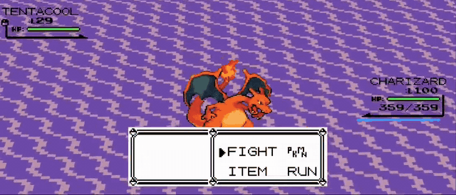
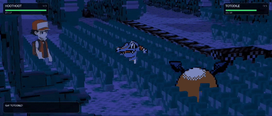
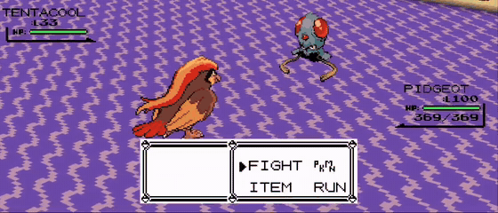
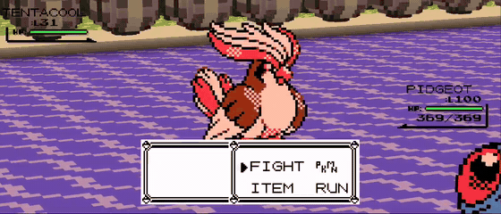
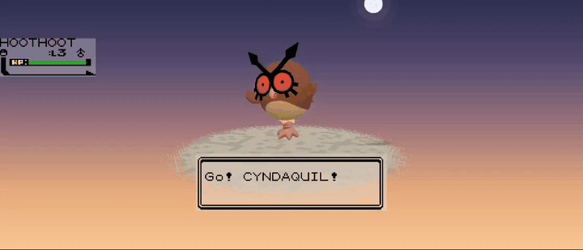
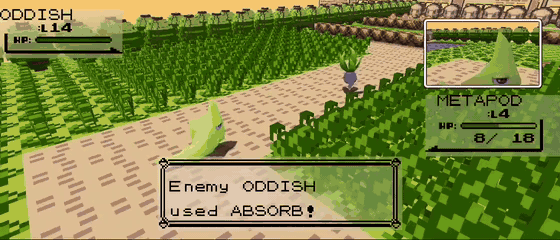
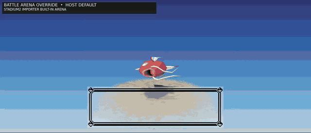

# 🎥 Battle Cinematics – Dynamic 3D Battle Camera

### A top-level cinematic battle director for Pokémon Gen1Recomp

**Stadium 64 • 4-Way Sprite View • Pokémon Intro • Attack & Faint Cameras • Secondary View • Live Voxel Arenas • Gen 1 + Gen 2**

<!-- PRIME SHOWCASE
Final target: media/Battle_Cinematics_Prime_Showcase.mp4
Optional short looping preview: media/Battle_Cinematics_Prime_Showcase.gif
The reel should show, in order: 4-Way sprites -> Crystal -> Gen5 animated -> genuine Stadium 3D -> Stadium/Intro/Attack/Faint -> Secondary View -> Live Voxel Arena.
-->

https://github.com/user-attachments/assets/c924c8c4-9fda-44be-b7e7-76e48cd88577

**Battle Cinematics (BC)** is the camera/director layer for battles. It brings the cinematic language of Pokémon Stadium into Recomp, then adapts that language around the presentation you choose: classic sprites, animated sprites, voxel worlds, genuine Stadium models and supported live battle hosts.

BC does **not** replace those renderers, models, animations or assets. It directs the camera around them.

> **Stadium supplied the cinematography. BC supplied the camera system.**
>
> **BC directs. Providers present. Renderers render. Assets remain theirs.**

Stadium models are optional. Battle Cinematics is designed to make the presentation you already use look intentional from a moving cinematic camera.

**Battle Cinematics v1.2.4 has been tested with Gen1Recomp through v0.2.38.**

[**Download the latest release**](https://github.com/EnterPlayerOne/Battle-Cinematics-Stadium-Camera/releases/latest)

---

## What Battle Cinematics changes during a battle

BC is modular. Use the complete presentation or only the camera phases you want.

| Battle moment | Battle Cinematics |
|---|---|
| **Idle / command menu** | Stadium 64, DW3 Classic, Hero Portrait or External host camera |
| **Flat sprites** | Camera-aware **4-Way Sprite View** where supported |
| **Pokémon send-in** | BC Hero FULL / COMPACT cinematic introductions |
| **Moves** | Stadium-inspired, move-aware Attack Camera |
| **Faint** | Dedicated final composition for the defeated Pokémon |
| **Secondary view** | Optional independent PiP camera, including CONTINUOUS monitor mode |
| **Stadium2 Importer arena** | Optional **LIVE VOXEL ARENA** override on supported Gen 1 stacks |
| **Manual camera** | BC-owned on Gen 1; compatible provider-owned control on Gen 2 |

The core rule underneath all of it is:

> **Every BC option produces a good, readable battle everywhere, with BC free to gracefully degrade its physical camera language when the environment cannot support it.**

---

# Compatibility

Battle Cinematics is a director, not a battle renderer. A supported presentation host still owns the world, sprites, models and animation it provides.

The tables below describe the **current tested state**, not every historical version that has ever worked. As compatibility is refined, these tables should be replaced rather than accumulated.

## Gen 1 / RBY

| Presentation / host | Main BC Cameras | 4-Way Sprite View | Secondary View | Stadium2 Importer / arena notes |
|---|:---:|:---:|:---:|---|
| **Dramaless Shape 2.0.3** | ✅ | ✅ | ✅ | Vanilla / Crystal / Importer validated. **LIVE VOXEL ARENA** supported. Provider-native bounded manual fallback retained for the Dramaless + Importer combination. |
| **Battle Art Voxel Fork 1.9.9** | ✅ | ✅ | ✅ | Vanilla, animated / Gen 5 and Stadium2 Importer presentation validated. Battle Art retains its own Importer environment path; BC keeps narrow projection recovery for strong camera compositions. |
| **Dramatic Shape 1.9.0** | ✅ | ✅ | ✅ | Vanilla / Crystal / Importer validated. **LIVE VOXEL ARENA** supported. |
| **Voxel Ascendant 2.0.2 — MAP** | ✅ | ✅ | ✅ | Vanilla / Crystal / Importer MAP validated. **LIVE VOXEL ARENA** supported. ARENA / DISCS are not currently claimed. |
| **PotatoVoxel 1.9.6 — Gen 1 MAP / 2D-3D A** | ✅ | ✅ | ✅ | Gen 1 validated with Stadium2 Importer **LIVE VOXEL ARENA**. |
| **Voxel Ultimate 1.0.7 — Gen 1** | ✅ | ✅ | ✅ | Integrated host path validated. Avoid stacking duplicate systems that Voxel Ultimate already integrates. |
| **Stadium2 Importer 0.12.0 — Gen 1** | ✅ | 3D yield | ✅ | Genuine Stadium presentation retained. Can use supported **BATTLE ARENA OVERRIDE** providers below. |
| **Crystal Animated Sprites 2.0.2** | ✅ | ✅ | ✅ | Animated sprite presentation supported on established compatible host paths. Fixed animated FRONT Secondary View remains independent from the main 4-Way view. |
| **Compatible vanilla / ROM sprite presentation** | ✅ | ✅ | ✅ where host-supported | BC uses the host's actual sprite presentation rather than replacing the artwork. |
| **StadiumBattleFX** | ✅* | 3D yield | ✅ | **Gen1 Stadium model presentation supported.** Proven with **Dramaless Shape 2.0.3** when SBFX `BATTLE ARENA` is set to the registered **VOXEL ARENA** provider. Other voxel-provider combinations are provider/version-specific; see notes below. |

### Gen 1 LIVE VOXEL ARENA providers for Stadium 2 Importer

- **Dramaless Shape 2.0.3**
- **Dramatic Shape 1.9.0**
- **Voxel Ascendant 2.0.2 — MAP**
- **PotatoVoxel 1.9.6 — MAP / 2D-3D A**

**Battle Art Voxel Fork 1.9.9** already supplies its Importer environment through its own established integration rather than BC's arena-override bridge.

>### StadiumBattleFX + voxel providers

>StadiumBattleFX can provide a separate Gen1 Stadium-model presentation while compatible voxel backends continue to provide the battle environment. This is provider-specific and should not be assumed to work identically across every backend.

| Voxel provider | SBFX Stadium model state v2.1.8.1|
|---|---|
| **Dramaless Shape 2.0.3** | ✅ **Validated.** Select its registered voxel arena in SBFX `BATTLE ARENA`. Stadium models + voxel world + BC cameras + Secondary View work correctly. |
| **Dramatic Shape 1.9.0** | ⚠️ **Partial / not currently recommended.** Its voxel arena is recognised, but current testing can lose the battle UI |

## Gen 2 / GSC

| Presentation / host | Main BC Cameras | 4-Way Sprite View | Secondary View | Current state |
|---|:---:|:---:|:---:|---|
| **Gen2-3D-Sprites / `STADIUM2_OVERWORLD_MODELS` 0.2.81** | ✅ | ✅ on 2D world-card path | ✅ | Genuine Stadium 3D, vanilla 2D and Crystal presentation validated. Provider owns Gen 2 right-stick behavior. |
| **Voxel Ultimate 1.0.7 — Gen 2** | ✅ | ✅ on supported flat-card path | ✅ | Integrated live-world Gen 2 host validated. Provider-native manual camera retained with BC battle-boundary neutral protection. |
| **Crystal Animated Sprites 2.0.2** | ✅ | ✅ on compatible world-card paths | ✅ | Crystal artwork/animation remains provider-owned; BC supplies camera-relative orientation and secondary composition where supported. |

> [!NOTE]
> **Current ecosystem boundary:** direct Stadium2 Importer 0.12.0 Gen 2 3D and PotatoVoxel Gen 2 3D are **not currently claimed**. Fresh Crystal and Silver testing does not establish those providers' own standalone 3D battle path even with BC disabled. BC does not build compatibility workarounds around a provider path that is not presently functioning independently.

`STADIUM2_OVERWORLD_MODELS` 0.4.33 is also not currently claimed; 0.2.81 is the validated compatibility ceiling for this BC line.

---

# Using Battle Cinematics

The sections below follow the in-game Battle Cinematics menu. New permanent features should be added to this sequence; version-specific history belongs in GitHub Releases instead of being appended to the README.

---

## 1. Camera Authority

`CAMERA AUTHORITY` is the top-level BC ownership control.

- **BC PRIORITY — default:** BC owns the camera phases you have enabled.
- **COOPERATIVE:** allows compatible presentation systems more room to participate where supported.
- **BC DISABLED:** leaves BC installed but stops BC camera ownership.

Ownership is **phase-scoped**, not battle-wide. A host can own the idle camera through External while BC still owns Pokémon Intro, Attack or Faint.

---

## 2. 4-Way Sprite View

A separate vanilla / ROM-sprite example shows the same camera-relative presentation on the flat-card path:

**4-WAY SPRITE VIEW** makes supported flat-card Pokémon behave like world-facing actors instead of cards permanently locked to one battle-screen direction.

BC can independently resolve each battler's normal **FRONT / BACK** representation and then orient it **LEFT / RIGHT** toward the fight as the final camera moves.

This creates a practical four-way presentation without requiring four separate sprite assets.

- **DYNAMIC — default:** full camera-aware four-way behavior. BC selects FRONT/BACK per battler and applies LEFT/RIGHT facing.
- **TURN ONLY:** keep the host/provider's FRONT/BACK choice and apply only horizontal turning.
- **HOST DEFAULT:** zero-touch host presentation.

Genuine 3D Pokémon models automatically yield from this system.

### Animated sprite presentations

BC does not replace animated sprite providers. The provider keeps the artwork, animation, scale and lifecycle; BC supplies the camera-relative presentation layer where that host exposes a compatible path.

---

## 3. Idle Preset

The idle preset controls BC's passive camera while you are navigating the battle and no higher-priority cinematic phase is active.

### Stadium 64 — default

BC's source-faithful translation of the original **Pokémon Stadium** passive battle-camera language: wide establishing shots, player/opponent portraits, sweeping battlefield movement and rising horseshoe-style rotations.

The Stadium choreography was captured from the original game and translated into relative compositions rather than blindly replaying N64 world coordinates. That lets BC preserve the visual language while adapting it to Recomp's actual battle environment.

### DW3 Classic

The original Battle Cinematics camera language. DW3 is more intimate and interpretive, with orbital movement, shoulder compositions and close environmental framing.

### Hero Portrait

A calmer passive style that keeps the Pokémon visually dominant with less physical camera travel.

### External

`EXTERNAL` yields the passive / idle camera to the active compatible host.

> **EXTERNAL CAMERA — HOST OWNED**  
> **BC PHASE MODULES — STILL INDEPENDENT**

Pokémon Intro, Attack Camera, Faint Camera and Secondary View can remain independently enabled.

### Configure Preset

Stadium 64, DW3 Classic and Hero Portrait each expose contextual tuning without cluttering the main menu:

- Framing: Extra Wide / Wide / Standard / Near / Close
- Orbit Speed: Slowest / Slow / Medium / Fast
- Height: Low / Standard / High
- Angle: Shallow / Standard / Strong

---

## 4. Idle View

`IDLE VIEW` is a renderer-neutral optical modifier for ordinary BC passive/menu cameras.

- Standard — default
- Wide
- Extra Wide
- Ultra Wide

It changes the viewing width without rewriting the authored physical camera path.

---

## 5. Initial Delay

Controls how long BC waits before beginning passive cinematography after a usable battle camera is established.

- Immediate
- **2 Seconds — default**
- 4 Seconds
- 6 Seconds
- 9 Seconds
- 12 Seconds
- 15 Seconds

Intro / Attack / Faint remain their own battle-aware phases; this delay is for passive cinematography.

---

## 6. Pokémon Intro — BC Hero

<!-- SHOWCASE: Stadium2Importer Stadium.mp4 opening / strongest existing BC Hero clips -->

BC Hero gives newly presented Pokémon a dedicated cinematic send-in before handing cleanly into the passive battle camera.

The lifecycle understands the battle rather than replaying one intro blindly:

- opening Pokémon → **FULL**;
- enemy replacement → **FULL**;
- forced player replacement after faint → **FULL**;
- later voluntary switch against an established opponent → **COMPACT**;
- battle progression / move commitment immediately wins if the game moves on.

### Configure Intro Cam

- Framing: Extra Wide / Wide / Near / Close
- Speed: Slow / Normal / Fast / Faster
- Hero Tilt: Off / On
- Cancel: B Button / Any Input / On Move/Item / Off
- Reset to Default

Current intended baseline is **WIDE** framing with **Hero Tilt OFF**.

---

## 7. Stadium Attack Camera

The optional **ATTACK CAMERA → STADIUM** follows the actual move presentation rather than forcing every attack through one generic animation.

BC can reason about semantic move roles such as attacker declaration, travel/tracking, recipient/impact, SELF actions, FIELD-style actions and different animation windows. Camera timing follows the real battle presentation and remains compatible with accelerated game speed.

The Attack Camera is independent of the selected idle preset.

---

## 8. Faint Camera

`FAINT CAMERA → ON` gives the defeated Pokémon a dedicated final composition.

It remains phase-scoped and renderer-independent. On provider-owned Gen 2 presentations, BC follows the real visible faint lifecycle rather than artificially keeping an actor alive after the host removes it.

---

## 9. Secondary View PiP

Secondary View is an optional **independent second camera**. It is not a crop of the main view.

`SECOND VIEW PIP` defaults **OFF** so updating BC never silently adds another rendered view.

When enabled, `CONFIG PIP` provides:

### PiP Visibility

- **CONTINUOUS — default:** after the initial player send-in completes and PiP arms, the secondary camera remains a persistent monitor through attacks, reactions, fainting, an empty player side, replacement and subsequent send-in.
- **DYNAMIC (DW3):** the original authored behavior, where PiP appears only during appropriate battle phases.

### PiP View

- Size: Standard / **Small — default**
- Framing: **Normal — default** / Close
- Side: **Left (DW3) — default** / Right
- Place: Mid Center / Top Right / **Mid Right — default** / Top Left / Mid Left / Custom

Custom placement can be adjusted directly on supported mouse/touch frontends.

Different hosts expose different safe private-render seams. BC therefore does not treat Secondary View as one universal duplicated scene. The provider remains responsible for its world/art/model state while BC owns the alternate camera/composition.

### Performance rule

> **PiP size on screen must not require a second full-resolution world render.**

Heavy 3D Secondary View paths use bounded private targets and conservative draw scheduling where required.

>⚠️ Secondary View maintains its own lightweight presentation of the battle. Current 3D backends mirror battle state and major transitions like fainting, but individual model animation timing may differ from the primary presentation at this stage of development.

---

## 10. Battle Arena Override

`BATTLE ARENA OVERRIDE` controls **environment ownership** for supported Gen 1 Stadium2 Importer compositions.

- **LIVE VOXEL ARENA — default:** use a compatible live voxel/world provider as the battle environment while Stadium2 Importer keeps its genuine Stadium actors, animation and HUD.
- **HOST DEFAULT:** leave the environment entirely to Stadium2 Importer.

This setting changes the **arena only**. It does not enable Stadium models and it does not turn a 2D battle into a 3D battle.

The intended division of responsibility is simple:

> **Voxel provider → world / arena**  
> **Stadium2 Importer → Stadium models / animation / HUD**  
> **Battle Cinematics → camera direction / Secondary View**

Supported BC-managed LIVE VOXEL ARENA providers are listed in the Gen 1 compatibility table above.

---

## 11. Legacy Options

`RESET CAMERA` retains older input-driven escape-hatch behavior:

- **Off — default**
- Confirmed Action
- Any Input

Most users should leave this Off. BC's current battle-aware phase lifecycle normally handles camera transitions without needing generic input cancellation.

---

## 12. Diagnostics / Reset

Diagnostics are intended for compatibility testing and support, not normal play. Keep them **OFF** unless you are deliberately gathering evidence for a problem.

Reset Defaults restores the current BC defaults for the relevant configuration.

---

# Presentation-aware framing — APB

**Actor Presentation Bounds (APB)** is BC's renderer-neutral language for understanding the Pokémon currently being presented.

Instead of assuming every actor occupies the same volume, compatible adapters can describe facts such as visible top/bottom, visual centre, presented height, elevation and breadth. Each authored camera shot then decides how much of that information it should consume.

> **APB understands the whole presented actor; the authored shot decides how much of that actor it wants to show.**

That distinction matters: Onix can be tall and grounded, Pidgeotto can be genuinely elevated, Articuno can be broad, Snorlax can be bulky, and a classic fixed-card sprite may already fit perfectly without needing dramatic correction.

No Pokémon species, type or model-name camera hardcodes are required for those decisions.

---

# Camera safety without camera sameness

Recomp battle environments are not empty Stadium arenas. Routes, caves, forests and towns contain boundaries, walls, trees, ledges, rocks, façades, roofs and renderer-specific dead zones.

All BC camera modules pass through shared protection systems that can:

- keep the camera inside valid map space;
- prevent physical traversal through known structural geometry;
- protect narrow routes and 3D → 2D presentation boundaries;
- recover from sustained subject obstruction;
- reason about building body / façade / roof structure where reliable evidence exists;
- substitute an impossible physical route while preserving the intended cinematic composition.

Safety is infrastructure, **not** a replacement aesthetic.

A tree crossing the foreground can be good cinematography. A camera physically travelling through that tree is not.

.gif)

%20(1)%20(3).gif)

BC deliberately preserves useful foreground grazing and environmental depth wherever the subject remains readable.

---

# Manual camera ownership

## Gen 1 / RBY

BC owns the established manual-camera contract:

> **grab current BC shot → free orbit / look → release → soft return to authored BC camera**

4-Way Sprite View follows the final camera, so supported flat-card actors remain spatially coherent while the user moves around the battle.

The exact **Dramaless + Stadium2 Importer** composition intentionally uses the provider's bounded native manual behavior rather than unrestricted BC free orbit, because that host combination has its own safe camera envelope.

## Gen 2 / Gold, Silver, Crystal

The active compatible provider owns the right stick. BC does not run the separate Gen 1 manual subsystem on top of it.

Voxel Ultimate and `STADIUM2_OVERWORLD_MODELS` keep their provider-native manual-camera semantics while BC retains its configured camera phases.

---

# Quick setup guidance

### I want BC cinematography with sprites

Use a supported live battle/world host and leave **4-WAY SPRITE VIEW → DYNAMIC**. Stadium models are not required.

### I want genuine Stadium models

On Gen 1, use **Stadium2 Importer 0.12.0**. BC can direct Stadium 64 / DW3 / Hero, Pokémon Intro, Attack, Faint and Secondary View over the provider presentation.

On current Gen 2, use a validated working host such as **`STADIUM2_OVERWORLD_MODELS` 0.2.81** or **Voxel Ultimate 1.0.7**.

### I want Stadium models in the actual voxel world

On a supported Gen 1 composition, set:

`BATTLE ARENA OVERRIDE → LIVE VOXEL ARENA`

The voxel provider supplies the environment, Stadium2 Importer supplies the actors/HUD, and BC directs the camera.

### I want the host's idle camera but BC's battle cinematics

Set:

`IDLE PRESET → EXTERNAL`

Then leave Pokémon Intro / Attack / Faint enabled as desired.

> **Using StadiumBattleFX models?**  
> **Dramaless Shape 2.0.3** is the currently validated voxel-world companion. In SBFX, set `BATTLE ARENA` to the registered **VOXEL ARENA** entry for Dramaless, then let Battle Cinematics handle camera direction.

---

# Troubleshooting

### My Pokémon looks camera-locked or faces the wrong way

First check **4-WAY SPRITE VIEW → DYNAMIC** on a supported flat-card path. Older advice to force particular back/front settings is not the general BC model anymore; validated Dynamic adapters should normally own the camera-relative choice themselves.

If you deliberately choose HOST DEFAULT, the host's own fixed presentation may naturally look less spatially convincing during large camera movements.

### A provider says it supports 3D, but BC only sees 2D

Test the provider **without BC first**. BC can adapt a working presentation path; it does not manufacture a provider's missing 3D battle scene.

### Gen 2 right stick behaves differently from Gen 1

That is intentional. Gen 1 uses BC's manual camera. Current supported Gen 2 hosts retain provider-owned manual input.

### A camera shot changes in a constrained environment

That can be intentional safety behavior. BC preserves the authored composition where possible and may change the physical route when the environment cannot support it safely.

### Voxel Ultimate behaves strangely with several overlapping presentation mods

Treat Voxel Ultimate as an integrated host. Avoid stacking standalone equivalents of systems it already includes unless the combination is known-good; duplicate provider ownership can create conflicts outside BC's control.

---

# Installation

1. Download the latest `BATTLE_CINEMATICS-x.x.x.zip` from [Releases](https://github.com/EnterPlayerOne/Battle-Cinematics-Stadium-Camera/releases/latest).
2. Install it through the normal Gen1Recomp mod workflow.
3. Enable the compatible battle/world/model presentation you want to use.
4. Configure Battle Cinematics from its structured in-game mod options.

For **what changed in a specific version**, see that version's GitHub Release notes. The README describes the current product and current compatibility state.

---

# Interoperability and credits

**EnterPlayerOne** — Battle Cinematics design and development.

Battle Cinematics remains the camera/director layer. The following renderers, providers, sprite systems, effects systems and model projects remain the work of their respective authors:

- **Dramatic Shape**
- **Dramaless Shape** — artyrambles
- **Battle Art Voxel Fork** — absol89
- **PotatoVoxel** — ShaneMcGovernIE
- **Voxel Ascendant** — Roxas2712
- **Voxel Ultimate**
- **Crystal Animated Sprites with Shiny Visuals** — distilledorion-sketch
- **Stadium2 Importer** — Deftones565
- **Gen2-3D-Sprites / `STADIUM2_OVERWORLD_MODELS`** — randyadr
- **StadiumBattleFX** — Root Beer Ronin / anxiousintrovert

**Darkatek7** — scoped credit for identifying the accelerated `input.Step / Game:logicSpeed()` timing path and supplying the original patch that led to BC's game-speed compatibility implementation.

**StadiumBattleFX / Root Beer Ronin** is also acknowledged as a cousin Stadium-focused project whose parallel development helped spur Battle Cinematics' continued Stadium interoperability work. This is an inspiration / ecosystem acknowledgement, not Battle Cinematics code authorship.

**ZEROstig** — thanks for continued YouTube exposure, encouragement and showcasing Battle Cinematics to the wider Gen1Recomp community.

Thanks to everyone who has tested BC across different routes, generations, renderers, presets and increasingly unreasonable camera situations.

> A great deal of Battle Cinematics exists because somebody found the arena where the camera finally said no.

---

# Permissions / license

Battle Cinematics v1.2.1+ is distributed under the **Battle Cinematics Source-Available License 1.0**.

The source remains available for inspection, learning, private/personal modification and contributions back to the official project. Public redistribution, repackaging, rebranding, successor forks, substantial incorporation into another distributed project, sublicensing or commercial redistribution require prior written permission.

Historical copies released under MIT remain governed by the license that accompanied those copies.

See [`LICENSE`](LICENSE) for the complete terms.

---

**Passives. 4-Way Sprites. Intros. Attacks. Faints. Secondary View. Live Arenas. One adaptable camera system. Gen 1 + Gen 2.**
