# 🎥 Battle Cinematics – Dynamic 3D Camera

### Passive cameras • Pokémon Intros • Move-aware Attacks • Faints • Gen 1 + Gen 2

<!-- HERO MEDIA SLOT
Recommended: one of the short v1.0.6/v1.0.7 GIFs — Articuno is the strongest opener.
Example once uploaded:

-->

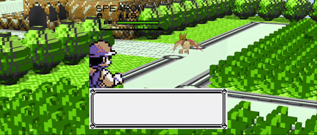

[▶ Watch the full Battle Cinematics APB Showcase](Battle_Cinematics_v1.0.6_APB_Showcase_v2.mp4)

**Battle Cinematics (BC)** is a complete battle-camera director for Pokémon Recomp.

Choose a dynamic passive camera, then independently configure cinematic Pokémon introductions, a move-aware Attack Camera and Faint Camera. BC adapts its framing to the presentation you use — 3D models, animated sprites, alternative battle renderers and different arena layouts — while preserving each backend's own visual identity.

> **Stadium supplied the cinematography. BC supplied the camera system.**
>
> **Stadium models are not required.**

**[Download the latest release](https://github.com/EnterPlayerOne/Battle-Cinematics-Stadium-Camera/releases/latest)**

---

## What BC changes during a battle

BC is modular. Its major camera phases can be enabled and configured independently.

| Battle phase | What BC can do |
|---|---|
| **Passive / idle battle** | Stadium 64, DW3 Classic, Hero Portrait, or External host camera |
| **Pokémon Send-In** | BC Hero FULL / COMPACT cinematic introductions |
| **Moves** | Stadium-inspired, move-aware Attack Camera |
| **Faint** | Dedicated final composition for the defeated Pokémon |
| **Manual camera** | BC-owned manual camera on Gen 1; compatible host/provider control on Gold |

You can use the whole package or only the pieces you want.

---

# Passive battle cameras

The passive camera is what BC uses while you are navigating the battle and no higher-priority cinematic phase is active.

## Stadium 64 — default

BC's source-faithful translation of the **Pokémon Stadium** battle-camera language.

Wide establishing movement, sweeping opponent and player compositions, rising horseshoe rotations and classic Stadium battlefield framing — adapted to the physical environment available in Recomp rather than blindly replaying unsafe coordinates.

<!-- MEDIA SLOT: Pidgeotto rising Stadium horseshoe / Articuno wide opening -->
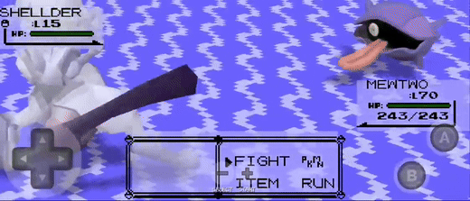
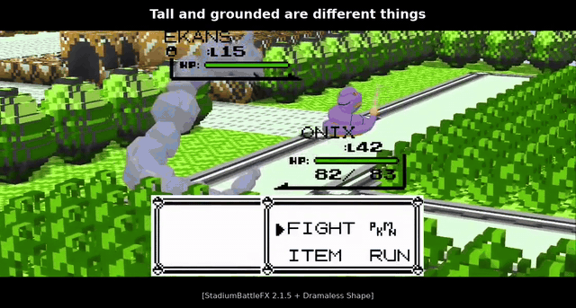

## DW3 Classic

The original Battle Cinematics camera language.

DW3 is more intimate and interpretive than Stadium 64, built around orbital movement, shoulder compositions and environmental close framing. Its framing, orbit speed, height and angle are configurable independently.

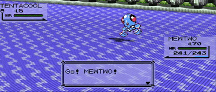

## Hero Portrait

A calmer passive style centred around strong Pokémon portrait compositions.

Hero Portrait keeps the subject visually dominant with less physical camera travel, making it a useful option for players who want cinematic framing without constant large movement.

## External

**External yields the passive / idle camera to the active presentation host.**

BC remains installed and its other phase modules remain independent:

- BC Hero Send-Ins can remain enabled;
- Attack Camera can remain enabled;
- Faint Camera can remain enabled;
- Camera Authority still applies to the phases BC is configured to own.

In other words:

> **EXTERNAL CAMERA — HOST OWNED**  
> **BC PHASE MODULES — STILL INDEPENDENT**

External is generic BC architecture, not a Randy-specific preset. Battle Voxels own idle camera will similarly occupy an external opening that yields to their design.

---

# Pokémon Intro — BC Hero

BC Hero gives newly presented Pokémon a dedicated cinematic Send-In before handing cleanly into the passive battle camera.

The lifecycle is battle-aware rather than simply replaying the same intro every time:

- opening Pokémon → **FULL**;
- enemy replacement → **FULL**;
- forced player replacement after faint → **FULL**;
- later voluntary player switch against an established opponent → **COMPACT**;
- battle progression / move commitment always wins immediately.

### Current Intro controls

- **Framing:** Extra Wide / **Wide** / Near / Close
- **Speed:** Slow / Normal / Fast / Faster
- **Hero Tilt:** **Off** / On
- **Cancel:** B Button / Any Input / On Move/Item / Off
- Reset to Default

### v1.0.6+ Intro baseline

Presentation-aware framing made the old Intro defaults unnecessarily tight/high.

The current intended baseline is:

- **Framing → WIDE**
- **Hero Tilt → OFF**

Existing users receive this change **once** through BC's one-time migration system, then BC permanently respects whatever they choose afterward.

And every Intro can still simply be skipped with a press of B.

---

# Stadium Attack Camera

Battle Cinematics does not stop when the menu closes.

The optional Stadium Attack Camera follows the actual move presentation rather than forcing every move through one generic camera animation.

BC understands semantic move roles such as:

- attacker declaration / launch;
- travel / tracking;
- recipient / impact;
- SELF moves;
- FIELD-style actions;
- short and long animation windows.

Camera timing follows the real battle presentation and remains compatible with accelerated game speed.

With Actor Presentation Bounds active, Attack Camera framing also understands the presented attacker and recipient rather than assuming both occupy the same vertical space.

<!-- MEDIA SLOT: Onix Rock Throw -> recipient -> faint sequence -->

---

# Faint Camera

Optional Faint Camera gives the defeated Pokémon a dedicated final composition.

It remains phase-scoped and renderer-independent. On Gold, BC follows the host's real visible faint presentation rather than artificially freezing a Pokémon after the game has already removed it.

---

# Actor Presentation Bounds — APB

BC no longer assumes every Pokémon occupies the same visual volume.

**Actor Presentation Bounds (APB)** is BC's renderer-neutral subject-presentation language. Compatible presentation adapters can tell BC about the actor currently being shown; the camera then decides how that information should affect each authored shot.

APB can reason about:

- visible bottom / top;
- visual centre;
- presented height;
- elevation above the battle origin;
- horizontal breadth;
- source / confidence of the presentation evidence.

The governing rule is simple:

> **APB understands the whole presented actor; the authored shot decides how much of that actor it wants to show.**

Presentation awareness therefore does **not** mean forcing every Pokémon into a full-body shot.

### Why it matters

Different actors can require completely different interpretations:

- **Pidgeotto** can be genuinely elevated rather than merely "a Flying type";
- **Onix** is tall while remaining grounded;
- **Articuno / Moltres** can present extreme breadth;
- **Snorlax** is bulky without needing to be treated as the same shape class as a wide-winged bird;
- **Hoothoot** on Stadium2 can have a visibly elevated idle presentation without the camera following every animation bob.

No species, type, Flying-type, Stadium-model-name or route hardcodes are required for those decisions.

<!-- MEDIA SLOT: 2–4 APB GIF strip
Suggested order: Pidgeotto / Onix / Snorlax / Hoothoot
-->

### Pidgeotto: where APB began

### Onix: tall and grounded are different things

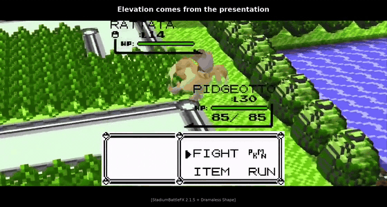

### Snorlax: breadth is its own presentation axis

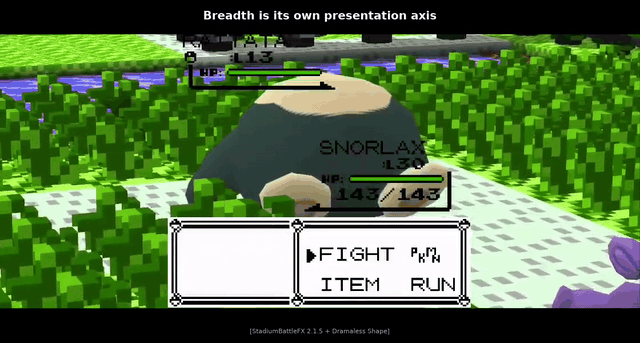

### Mew: presentation-aware, still cinematic

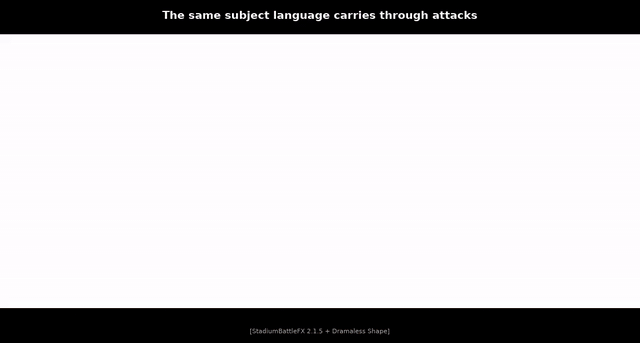

### Gold / Stadium2: the same presentation language reaches Gen 2

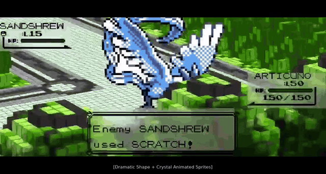

### 2D sprites

BC can also translate compatible sprite/card presentation into the same APB language.

For classic fixed-card Gen 1 / Gen 2 sprite art, the correct result is often deliberately subtle: those sprites were authored to fit inside a constrained battle-picture frame already, so BC should usually leave an already-good composition alone.

That is still useful evidence — a different presentation medium can enter the same BC subject language without forcing a different camera aesthetic.

---

# Gen 1 + Gen 2

Battle Cinematics supports both generations, but it deliberately does **not** pretend their presentation stacks are identical.

| Feature | Gen 1 / RBY | Gen 2 / Gold |
|---|---:|---:|
| Stadium 64 | ✅ | ✅ |
| DW3 Classic | ✅ | ✅ |
| Hero Portrait | ✅ | ✅ |
| External | ✅ | ✅ |
| BC Hero Send-In | ✅ | ✅ |
| Attack Camera | ✅ | ✅ |
| Faint Camera | ✅ | ✅ |
| Actor Presentation Bounds | ✅ | ✅ |
| BC-owned manual right stick | ✅ | — |
| Host/provider right stick | Backend-dependent | ✅ with current Gen2-3D-Sprites host |

## Gen 1 manual camera

On RBY, BC owns its manual camera system directly:

> **grab current shot → free orbit / look → release → soft return to authored BC camera**

## Gold / Randy manual camera

Gold deliberately does **not** run a second BC-owned right-stick subsystem on top of the current Gen2-3D-Sprites host.

With Randyadr's battle camera enabled, **Randy's native right-stick control remains available through compatible BC passive presets**. BC still authors its Stadium / DW3 / Hero compositions; the provider supplies the manual input layer.

`PRESET → EXTERNAL` is only required when you also want the **host to author the passive camera itself**.

Randyadr's Diorama, Third Person and First Person views remain host features and coexist with BC's phase-scoped direction.

### Randy third-person provider control through BC presets

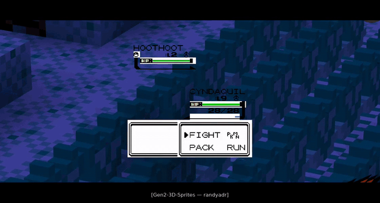

### Randy first-person provider control through BC presets

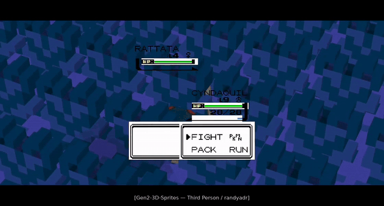

---

# Renderer and backend independence

Battle Cinematics is designed to sit **above** the active battle presentation.

It is not a Stadium-model dependency and does not require one particular model package, sprite system or renderer.

BC's Gen 1 backend discovery now recognises compatible live 3D camera hosts by capability rather than assuming that "3D battle" means one specific Stadium stack.

## Current validated environments

The following configurations have been directly tested on the current BC line:

- **Dramatic Shape**
- **Dramaless Shape 2.0.2**
- **PotatoVoxel 1.7.11**
- **Voxel Ascendant 0.1.1**
- **Battle Art Voxel Fork 1.9.4**
- **StadiumBattleFX 2.1.5** presentation on compatible Gen 1 hosts
- **Gen2-3D-Sprites / STADIUM2_OVERWORLD_MODELS** by randyadr on Gold
- standard and compatible custom 2D sprite presentations

- StadiumBattleFX 2.1.7 — validated.
BC remains the active camera director for any BC-enabled phases; SBFX effects continue underneath normally.
No special SBFX camera configuration is required for BC. If BC Attack Camera is enabled, BC owns the attack camera. id you prefer SBFX attack camera, simply toggle off BC Attack camera.

These are **presentation systems, not required dependencies**.

> **BC respects what the underlying system provides, then makes the best cinematic use of it.**

### Important 2D sprite note

> **Keep any fixed `Back Sprites` option OFF when using BC's moving cameras unless you specifically want that fixed presentation.**

A forced back-sprite card does not become a world-facing 3D actor simply because BC moves around it. During large camera movements it can therefore appear camera-locked or spatially incorrect even though the camera itself is behaving normally.

---

# Camera safety without camera sameness

Recomp battle arenas are not empty Stadium battlefields.

Routes, caves, forests and towns contain narrow paths, ledges, trees, rocks, rooftops, building façades, map boundaries and presentation dead-zones. BC's camera modules all pass through shared protection systems designed to preserve the cinematic shot **without allowing an invalid physical camera**.

BC can:

- prevent invalid camera occupancy / travel;
- respect map boundaries;
- protect narrow-route and 3D→2D transitions;
- recover from sustained subject obstruction;
- reason about building body / façade / roof structure where evidence exists;
- substitute an impossible authored movement with a readable cinematic alternative.

But safety is infrastructure — **not a replacement aesthetic**.

A tree beautifully crossing the foreground is allowed.  
A camera physically travelling through that tree is not.

A rooftop participating in the composition is allowed.  
A camera occupying the building underneath it is not.

Foreground elements on routes such as 1, 6 and 8 remain positive cinematographic controls rather than obstacles that BC blindly removes.

> **Every BC option produces a good, readable battle everywhere, with BC free to gracefully degrade its physical camera language when the environment cannot support it.**

<strong>Some of the environments that shaped BC's safety language</strong>

### Viridian Forest

Canopy can remain cinematic foreground while still acting as a physical surface the camera cannot simply descend through. BC can rise to a readable canopy crest, preserve that useful height during the authored shot and release the correction cleanly at the next cut.

### Power Plant / large structures

Large façades and roofs require a different language from ordinary walls. BC can derive a private semantic understanding of building body ↔ roof/top so structures can participate in path safety and view protection without route-specific hardcoding.

### Route 12 / local roofs

Small local roofs test whether a camera can establish the required viewing height as it reaches a structure rather than reacting too late.

### Open routes / Cerulean

When nothing prevents the authored movement, BC stays out of its own way and allows the full Stadium or DW3 choreography to breathe.

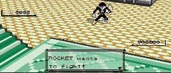

---

# Camera Authority

BC camera ownership is **phase-scoped**, not battle-wide.

`CAMERA AUTHORITY` controls how BC behaves when other compatible presentation systems also want to influence the battle camera:

- **BC PRIORITY** — default
- **COOPERATIVE**

External is the clearest example of this architecture: the host owns passive camera output while BC can still claim configured Send-In, Attack or Faint phases.

---

# Configuration reference

## Preset

Selects the passive battle camera:

- **Stadium 64 — Default**
- DW3 Classic
- Hero Portrait
- External

## Configure Preset

### DW3 Classic

- Framing: Standard / Near / Close
- Orbit Speed: Slowest / Slow / Medium / Fast
- Height: Low / Standard / High
- Angle: Shallow / Standard / Strong
- Reset to Default

### External

Information page:

> **EXTERNAL CAMERA**  
> **HOST OWNED**
>
> **BC PHASE MODULES**  
> **STILL INDEPENDENT**

## PKMN Intro Cam

- BC Hero
- Off

### Configure Intro — BC Hero

- Framing: Extra Wide / **Wide** / Near / Close
- Speed: Slow / Normal / Fast / Faster
- Hero Tilt: **Off** / On
- Cancel: B Button / Any Input / On Move/Item / Off
- Reset to Default

## Attack Camera

- **Stadium — Default**
- Off

Attack Camera is independent of the passive preset.

## Faint Camera

- **On — Default**
- Off

## Initial Delay

Controls how long BC waits before passive cinematography begins:

- Immediate
- **2 Seconds — Default**
- 4 Seconds
- 6 Seconds
- 9 Seconds
- 12 Seconds
- 15 Seconds

## Legacy — Reset Camera

Historical escape-hatch behaviour remains available:

- **Off — Default**
- Confirmed Action
- Any Input

`Any Input` remains an explicit legacy opt-in because ordinary menu navigation can otherwise cancel the passive camera.

---

# Mix and match

Battle Cinematics is intended to occupy the **camera/director layer** of a modular Recomp setup.

Use whichever presentation you prefer:

- models or sprites;
- vanilla or custom battle art;
- supported live 3D battle backends;
- StadiumBattleFX presentation;
- Gold Stadium2 presentation;
- BC Stadium, DW3, Hero or External camera ownership.

None of those visual choices force you to use Stadium 64.

Likewise, Stadium 64 does not require Stadium models.

Use the presentation you prefer and let BC direct the camera around it.

---

# Showcase

**Latest release / downloads:**  
https://github.com/EnterPlayerOne/Battle-Cinematics-Stadium-Camera/releases/latest

<!-- SHOWCASE MEDIA SLOT
Recommended: reuse Battle_Cinematics_v1.0.6_APB_Showcase_v2.mp4 or an uploaded GIF preview linked to the release.
Suggested caption:
Presentation-aware framing • Gen 1 + Gold • Backend interoperability
-->
[▶ Watch the full Battle Cinematics APB Showcase](Battle_Cinematics_v1.0.6_APB_Showcase_v2.mp4)
> Full showcase: APB / presentation-aware framing across Gen 1 + Gen 2.
> 
---

# Installation

1. Download the latest `Battle_Cinematics-vX.X.X.zip` from Releases.
2. Install it using the normal Recomp mod installation workflow.
3. Enable a compatible 3D battle backend / presentation stack where required by your chosen setup.
4. Configure BC from the in-game mod options.

For version-specific changes, migration notes, compatibility updates and showcase footage, see the individual release pages.

---

# Troubleshooting

### A 2D player sprite looks "locked" to the camera

Check whether your sprite / backend configuration has **Back Sprites** forced ON. Fixed back-art presentation can look spatially wrong once BC moves around the battle.

### A backend has a 3D battle option but BC does not recognise it

BC requires a compatible **live battle-camera host**, not merely a renderer that happens to draw Pokémon in 3D. Current validated hosts are listed above.

### Gold right stick does not behave like RBY

That is intentional architecture. RBY has BC's own manual-camera implementation. Gold currently uses the compatible host/provider's native manual input instead of running a second competing BC subsystem.

### A camera shot degrades or substitutes in a constrained arena

That can be intentional safety behaviour. BC preserves the authored composition where possible and may alter the physical route when the environment cannot safely support the original movement.

---

# Development direction

Battle Cinematics 1.x is a platform for additional camera languages rather than the end of the project.

Current directions include:

- **new passive camera presets / languages drawn from the games themselves**;
- additional renderer and host presentation adapters;
- continued Gen 2 interoperability and parity where useful;
- **Actor Presentation Orientation** research for compatible 2D-in-3D presentation systems;
- optional source/fidelity research where it adds something genuinely useful;
- continued compatibility work as the Recomp battle-presentation ecosystem evolves.

New work is developed on top of the last confirmed-good behaviour. Established camera language, safety, lifecycle and backend compatibility are treated as part of BC's contract rather than disposable implementation detail.

---

# Credits

**EnterPlayerOne** — Battle Cinematics design and development.

**Darkatek7** — identified and traced the accelerated `input.Step / Game:logicSpeed()` timing issue and supplied the original patch that led to BC's game-speed compatibility implementation.

Thanks to the developers of the Recomp battle renderers, model systems, sprite packs and presentation hosts that BC interoperates with, and to everyone who has tested Battle Cinematics across different routes, generations, backends, presets and increasingly unreasonable camera situations.

A great deal of BC exists because somebody found the arena where the camera finally said no.

---

# Battle Cinematics

**Passives. Intros. Attacks. Faints. One adaptable camera system. Gen 1 + 2.**

---

## License

MIT

---

BC is designed to **protect cinematography, not remove it**.

---
