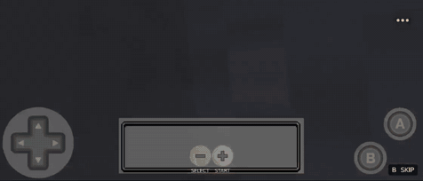
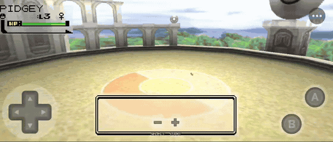

# 🎥 Battle Cinematics – Dynamic 3D Battle Camera

### A top-level cinematic battle director for Pokémon Recomp hosts

**Stadium 64 • Phenac Stadium • 4-Way Sprite View • Pokémon Intro • Attack & Faint Cameras • Secondary View • Live Voxel Arenas • Gen 1 + Gen 2 + Gen 3**


[](https://github.com/EnterPlayerOne/Battle-Cinematics-Stadium-Camera/releases/latest)
[](https://github.com/EnterPlayerOne/Battle-Cinematics-Stadium-Camera/releases)

<!-- PRIME SHOWCASE
Final target: media/Battle_Cinematics_Prime_Showcase.mp4
Optional short looping preview: media/Battle_Cinematics_Prime_Showcase.gif
The reel should show, in order: 4-Way sprites -> Crystal -> Gen5 animated -> genuine Stadium 3D -> Stadium/Intro/Attack/Faint -> Secondary View -> Live Voxel Arena.
-->


https://github.com/user-attachments/assets/c924c8c4-9fda-44be-b7e7-76e48cd88577


**Battle Cinematics (BC)** is the camera/director layer for battles. It brings the cinematic language of Pokémon Stadium into Recomp, then adapts that language around the presentation you choose: classic sprites, animated sprites, voxel worlds, genuine Stadium models and supported live battle hosts.

BC does **not** replace those renderers, models, animations or assets. It directs the camera around them, adapts to their presentation boundaries and can compose supported providers together without taking ownership of their content.

> **Stadium supplied the cinematography. BC supplied the camera system.**
>
> **BC directs. Providers present. Renderers render. Assets remain theirs.**

Stadium models are optional. Battle Cinematics is designed to make the presentation you already use look intentional from a moving cinematic camera.

**Quick links:** [Compatibility chart](#compatibility) · [CBE 2.0 setup](#validated-cbe-20--colosseum-overhaul-configuration) · [Using BC](#using-battle-cinematics) · [Installation](#installation)

> [!TIP]
> **v1.4.1 — Desktop PiP Dragging & Prism Sprite Facing:** drag a visible PiP with the left mouse button, including on the tested mouse-camera hosts. Prism's main Dynamic player FRONT orientation is corrected. Touch placement and the established camera/rendering behaviour are unchanged. [Release notes](https://github.com/EnterPlayerOne/Battle-Cinematics-Stadium-Camera/releases/tag/v1.4.1).

## v1.4.0 — Gen2Recomped

Battle Cinematics now supports **[Gen2Recomped](https://github.com/UNDERdecoded/Gen2Recomped)** through UNDERdecoded's bundled **Dramatic Shapes** presentation layer while remaining the same single official BC package used on **[Gen1Recomp](https://github.com/bryanthaboi/gen1recomp)** / GoldRecomp.

Runtime-validated on **Gen2Recomped 0.7.49** with the **Dramatic Shapes 0.7.47 release payload** (the provider currently reports `0.7.40` in its manifest/in-game):

- **RBY / Gen 1**
- **Gold / Silver / Crystal / Gen 2**
- **Prism / Gen 2**
- **Emerald / Gen 3**

Validated BC features include **Pokémon Intro, Stadium/DW3/Hero idle direction, Attack Camera, Faint Camera, Dynamic 4-Way Sprite View, provider-native structural safety, and bounded Secondary View/PiP with resolution-invariant framing**.

> [!NOTE]
> **Prism and Emerald remain alpha host cartridges.** Structural safety is deliberately conservative in this first integration, especially in Prism caves; an authored Pokémon Intro may shorten, hold or fall back when the provider geometry says the route is obstructed. Results can vary by location. Prism's longer send-in delay is provider-owned.

> [!NOTE]
> **Phenac Stadium is intentionally hidden/disabled on the Gen2Recomped Dramatic Shapes host.** The validated encounter-level Phenac opening remains available on its established Gen1Recomp / GoldRecomp provider paths. Ordinary **Pokémon Intro remains available** on Gen2Recomped.

**Polished Crystal is not claimed yet** because the current host does not expose it as an importable runtime cartridge in the tested build.

---

## v1.3.2 — Battle Art / Legendary Compatibility

**[Battle Art Voxel Fork](https://github.com/absol89/DramaticShapeVoxelMod) 1.10.8 and the current Legendary visual stack are fully runtime-validated with official Battle Cinematics on Gen 1.** The normal BC camera suite remains active across Battle Art environments, including the Legendary cave presentation: passive presets, Pokémon Intro, Attack and Faint cameras, 4-Way Sprite View and Secondary View all retain their established roles.

**Caves do not require a fixed one-side camera lock.** Battle Art owns its cave geometry and clearance rules; BC keeps its authored cinematography and adapts through the supported presentation instead of replacing the battle with a permanent side view.

**No separate Battle Cinematics compatibility fork is required for this tested stack.** Install the current official Battle Cinematics release alongside Battle Art 1.10.8 and the Legendary visuals you want to use. Battle Art and Legendary assets remain provider-owned; BC remains the camera/director layer.

This is a **compatibility-certification release**. Runtime camera behaviour is unchanged from v1.3.1 apart from release/version identity. The broader 2D-card live-state Secondary View enhancement remains pinned for a later cross-host pass rather than being patched specifically for Battle Art.

> [!NOTE]
> This v1.3.2 certification is for **Battle Art Voxel Fork 1.10.8 / Legendary on Gen 1**. Battle Art Gen2 is a separately versioned provider and retains its own exact compatibility row and test status.

---

## v1.3.1 — Stadium 2 Importer 0.14.2 + Native Stadium Arenas

**[Stadium 2 Importer](https://github.com/Deftones565/gen1recomp-mod-stadium2-importer) 0.14.2 is now validated directly with Battle Cinematics on Gen 1 and Gen 2.** Kenney/custom environments, native test fields and gym test arenas keep the main camera, live battler and matching Secondary View background together. The Importer owns the environments, models, animation and renderer; BC supplies the enabled camera direction and independent PiP composition.

Native Stadium arenas now use their actual battler positions, field scale and presentation bounds. BC's main view sits lower and closer instead of spending the composition on empty floor, while PiP frames the Pokémon at native-arena scale rather than looking above it. **The accepted Kenney framing is preserved.** Gen 1 PiP engagement and the reported Gen 2 black-frame flicker are corrected in the validated 0.14.2 paths.

**Phenac Stadium now runs on the tested Gen 2 provider-selected environment and native arena stages.** BC checks the live stage selection rather than rejecting a self-contained arena based on the original overworld map. Classic-scene safety and the separate live-world indoor restrictions remain unchanged. Gen 1 Phenac retains its accepted behaviour.

The complete v1.3.0 Colosseum work remains: CBE 2.0 and Colosseum Overhaul 1.0 on both generations, BC PRIORITY with the regular CBE camera ON or OFF, native Attack timing, all 11 CBE PiP cards and runtime doubles arbitration. CBE Phenac still requires AUTO BATTLE FLOW OFF and BOSS INTRO OFF.

> [!IMPORTANT]
> This is direct Importer **0.14.2** validation, not an automatic upgrade of every mixed-provider stack or a collision-free certification of every field. The separately reported Gen 2 Importer + Colosseum UI overlay conflict was reproduced on **0.14.0** with BC disabled; that UI stack is not recertified on 0.14.2 here.

**Battle Intro and Secondary View remain OFF for new users.** Existing saved BC choices remain intact.

### Stadium 2 Importer 0.14.2 — cave Phenac and attack



### Stadium 2 Importer 0.14.2 — Falkner test gym



**Earlier 0.14.0 Kenney showcases:** [Gen 2](media/Battle_Cinematics_Stadium_2_Importer_014_Kenney_Nature_Gen2.gif) · [Gen 1 / RBY](media/Battle_Cinematics_Stadium_2_Importer_014_Kenney_Nature_Gen1.gif)

---

## What Battle Cinematics changes during a battle

BC is modular. Use the complete presentation or only the camera phases you want.

| Battle moment | Battle Cinematics |
|---|---|
| **Idle / command menu** | Stadium 64, DW3 Classic, Hero Portrait or External host camera |
| **Flat sprites** | Camera-aware **4-Way Sprite View** where supported |
| **Battle opening** | Optional PHENAC STADIUM, independently assigned to Wild, Trainer, Gym Leader, Elite Four, Champion and Rival battles |
| **Pokémon send-in** | BC Hero FULL / COMPACT cinematic introductions |
| **Moves** | Stadium-inspired, move-aware Attack Camera; native body/effect timing for CBE 2.0 Colosseum models |
| **Faint** | Dedicated final composition for the defeated Pokémon |
| **Secondary view** | Optional independent PiP camera with **LIVE VIEW**, **LIVING PORTRAIT** or **DYNAMIC (DW3)** presentation |
| **PiP quality** | Independent internal render resolution from **160x90 through 1280x720** |
| **PiP appearance** | Independent ROUNDED / COLOSSEUM frame and WHITE / DARK / COLOSSEUM GREY border |
| **Stadium 2 Importer arena** | Optional **LIVE VOXEL ARENA** override where a compatible live-world provider is actually available |
| **Manual camera** | BC-owned on Gen 1 and on CBE in both generations; other Gen 2 providers retain their own control |

The core rule underneath all of it is:

> **Every BC option produces a good, readable battle everywhere, with BC free to gracefully degrade its physical camera language when the environment cannot support it.**

---

# Compatibility

Battle Cinematics is a director, not a battle renderer. A supported presentation host still owns the world, sprites, models and animation it provides.

**v1.4.1 compatibility:** **[Gen2Recomped](https://github.com/UNDERdecoded/Gen2Recomped) 0.7.49 + [Dramatic Shapes](https://github.com/UNDERdecoded/Gen2Recomped/releases/tag/v0.7.47) 0.7.47 release payload** is now validated across RBY, GSC/Crystal, Prism and Emerald with the caveats below. **[Battle Art Voxel Fork](https://github.com/absol89/DramaticShapeVoxelMod) 1.10.8 + the current Legendary visual stack** is runtime-validated on Gen 1, including caves with normal BC choreography. Direct [Stadium 2 Importer](https://github.com/Deftones565/gen1recomp-mod-stadium2-importer) **0.14.2** retains its accepted Gen 1 + Gen 2 Kenney/custom/native-arena/Phenac coverage; [CBE](https://github.com/HighDrexler/Colosseum-Battle-Environments-1.0-BETA) 2.0 and [Colosseum Overhaul](https://github.com/HighDrexler/Colosseum-Inspired-UI-Overhaul-V.1.0.0) 1.0 retain their accepted cross-generation support. Other rows keep their own exact version pins and caveats.

**Key:** ✅ = validated within the row’s stated host, generation and setup; ⚠️ = the recorded partial / re-audit status, not a new compatibility pass. **3D yield** means 4-Way Sprite View correctly leaves genuine 3D models alone; it is not a camera failure.

**Main BC Cameras** does not promise full Phenac on every map. Full Phenac is available on supported [CBE](https://github.com/HighDrexler/Colosseum-Battle-Environments-1.0-BETA) stages, explicit Importer **HOST DEFAULT** stages, the validated direct Importer 0.14.2 selected environment/native-arena stages, and recognised outdoor live maps. Other live-world interiors and unknown map contexts keep their existing safeguards and ordinary Pokémon Intro/other cameras. A provider-selected cave environment is not the same contract as an unverified live overworld cave.

### Desktop mouse PiP placement — v1.4.1

**Desktop:** left-click inside the visible PiP, drag it to a new position, then release to save **CUSTOM** placement. BC captures that gesture even when the presentation provider normally uses the mouse to steer its battle camera. Mouse camera handling outside the PiP is left alone and resumes after release. Existing touch placement is unchanged.

| Desktop runtime / game | Presentation provider | Validation scope |
|---|---|---|
| [Gen1Recomp](https://github.com/bryanthaboi/gen1recomp) / Gen 1 | [Dramaless Shape](https://github.com/artyrambles/DRAMALESS_SHAPE) | Mouse grab, drag and saved placement validated. |
| [Gen1Recomp](https://github.com/bryanthaboi/gen1recomp) **0.2.53** / Crystal | [Stadium2 Overworld Models](https://github.com/randyadr/Gen2-3D-Sprites) **0.2.81** | PiP drag works alongside the provider's mouse-controlled battle camera; provider control resumes after release. |
| [Gen2Recomped](https://github.com/UNDERdecoded/Gen2Recomped) / Prism | [Dramatic Shapes](https://github.com/UNDERdecoded/Gen2Recomped/releases/tag/v0.7.47) **0.7.47 release payload** | PiP drag and provider mouse-camera coexistence validated. The inherited host validation basis is 0.7.49; the provider manifest reports 0.7.40. |

These are input-interaction checks, not a fresh certification of every provider's renderer, animation or later version. Other compatibility rows and caveats below remain in force. [Stadium2 Overworld Models](https://github.com/randyadr/Gen2-3D-Sprites) 0.4.33 is **not** newly certified by this fix.

## Gen2Recomped host

The same `BATTLE_CINEMATICS` package is used on [Gen2Recomped](https://github.com/UNDERdecoded/Gen2Recomped). Current validation is specifically through UNDERdecoded's bundled **[Dramatic Shapes](https://github.com/UNDERdecoded/Gen2Recomped/releases/tag/v0.7.47)** provider. The provider's 0.7.47 release payload still declares version `0.7.40` internally, so the in-game version label is not a reliable discriminator.

| Cartridge | Main BC Cameras | 4-Way Sprite View | Secondary View | Current state |
|---|:---:|:---:|:---:|---|
| **RBY / Gen 1** | ✅ | ✅ | ✅ | Validated. Fixed-FRONT PiP portrait + live voxel world; some location-specific foreground/prop occlusion can remain. |
| **GSC / Crystal / Gen 2** | ✅ | ✅ | ✅ | Validated. Correct cross-host sprite scaling and PiP handedness. |
| **Prism / Gen 2** | ✅ | ✅ | ✅ | **Alpha host cartridge.** Structural safety is intentionally conservative, especially in caves; Intro travel may shorten/hold/fallback. Provider send-in delay remains provider-owned. **v1.4.1:** player FRONT handedness is corrected in main Dynamic 4-Way; BACK, enemy and PiP orientation are unchanged. |
| **Emerald / Gen 3** | ✅ | ✅ | ✅ | **Alpha host cartridge.** Gen3 lifecycle, Dynamic representation, Attack/Faint, structural safety and PiP validated. Native low-resolution sprite art remains pixel art even at higher PiP raster resolutions. |
| **Polished Crystal** | — | — | — | Not currently claimable/importable in the tested host build. |

**Battle Intro / Phenac Stadium is intentionally unavailable on this host.** This is a host-capability decision, not removal of Phenac from the normal [Gen1Recomp](https://github.com/bryanthaboi/gen1recomp) / GoldRecomp compatibility matrix.

## Gen 1 / RBY

| Presentation / host | Main BC Cameras | 4-Way Sprite View | Secondary View | [Stadium 2 Importer](https://github.com/Deftones565/gen1recomp-mod-stadium2-importer) / arena notes |
|---|:---:|:---:|:---:|---|
| **[Stadium 2 Importer](https://github.com/Deftones565/gen1recomp-mod-stadium2-importer) 0.14.2 — direct Gen 1** | ✅ | 3D yield | ✅ | Kenney/custom environments, test fields and gym test arenas validated. Native main-camera height/framing, live battler/APB PiP and matching backgrounds corrected. Gen 1 PiP engagement and Phenac retained. No automatic certification of older mixed-provider stacks. |
| **[Colosseum Battle Environments](https://github.com/HighDrexler/Colosseum-Battle-Environments-1.0-BETA) 2.0 — Gen 1** | ✅ | 3D yield (native models) | ✅ | **BC PRIORITY** works with [CBE](https://github.com/HighDrexler/Colosseum-Battle-Environments-1.0-BETA)’s regular camera ON or OFF. **DOUBLE BATTLES may remain ON**; actual [CBE](https://github.com/HighDrexler/Colosseum-Battle-Environments-1.0-BETA) doubles remain provider-owned. Phenac requires **AUTO BATTLE FLOW OFF** and [CBE](https://github.com/HighDrexler/Colosseum-Battle-Environments-1.0-BETA) Boss Intro OFF; BC shows an in-battle conflict notice if either blocks it. Native-animation-aware Attack timing, manual control and all **11 arena-themed PiP cards**. |
| **[Colosseum Overhaul](https://github.com/HighDrexler/Colosseum-Inspired-UI-Overhaul-V.1.0.0) 1.0 — Gen 1** | ✅ | 3D yield (native models) | ✅ | Exact combined [CBE](https://github.com/HighDrexler/Colosseum-Battle-Environments-1.0-BETA) 2.0 + Colosseum UI package validated. Same BC PRIORITY, Attack timing, manual-camera, PiP, Phenac and runtime-doubles arbitration as the standalone [CBE](https://github.com/HighDrexler/Colosseum-Battle-Environments-1.0-BETA) 2.0 integration. **AUTO BATTLE FLOW must be OFF for Phenac.** |
| **[Colosseum Battle Environments](https://github.com/HighDrexler/Colosseum-Battle-Environments-1.0-BETA) 1.8.4 — Gen 1** | ✅ | 3D yield (native models) | ✅; reaction caveat | Retained exact-stock adapter (`1.8.4-capture-member-hsd.1`). Keep **COLOSSEUM CAMERA OFF**. Primary cameras, intros, manual control and portable-actor PiP retained; Gen 1 PiP reactions can be less consistent than Gen 2. |
| **[Dramaless Shape](https://github.com/artyrambles/DRAMALESS_SHAPE) 2.0.4** | ✅ | ✅ | ✅ | Vanilla / Crystal / Importer validated. **LIVE VOXEL ARENA** supported. Provider-native bounded manual fallback retained for the Dramaless + Importer combination. v1.2.6 performance verified. |
| **[Battle Art Voxel Fork](https://github.com/absol89/DramaticShapeVoxelMod) 1.10.8 + Legendary visuals** | ✅ | ✅ | ✅ | **Full tested Gen 1 host compatibility.** Vanilla / animated Gen 5 cards and the current Legendary environment stack are validated with BC. Caves retain normal BC choreography rather than requiring a permanent one-side lock. Battle Art owns its world, cards and environment safety; BC keeps camera direction. The separate cross-host 2D PiP live-state enhancement is pinned for later and is not a Battle Art-specific compatibility patch. |
| **[Official Dramatic Shape](https://github.com/DramaticShape/DramaticShapeVoxelMod) 1.6.1 — Gen 1 MAP / A** | ✅ | Inherited supported flat-card path | Functional; stale-environment concern remains | **LIVE VOXEL ARENA** replaces Importer blue. Hosted world is bounded to 960×540 maximum, preserving aspect; Importer actors/HUD remain full-resolution. Android main-world performance improvement validated. B/disc modes yield to host. |
| **[Voxel Ascendant](https://github.com/Roxas2712/voxel-ascendant) 2.0.2 — MAP** | ✅ | ✅ | ✅ | Vanilla / Crystal / Importer MAP validated. **LIVE VOXEL ARENA** supported. ARENA / DISCS are not currently claimed. |
| **[PotatoVoxel](https://github.com/ShaneMcGovernIE/potato_voxel) 1.9.6 — Gen 1 MAP / 2D-3D A** | ✅ | ✅ | ✅ | Gen 1 validated with [Stadium 2 Importer](https://github.com/Deftones565/gen1recomp-mod-stadium2-importer) **LIVE VOXEL ARENA**. v1.2.6 main/PiP APB framing, passive paths and one-world performance verified. |
| **Voxel Ultimate 1.0.7 — Gen 1** | ✅ | ✅ | ✅ | Integrated host path validated. Avoid stacking duplicate systems that Voxel Ultimate already integrates. |
| **[Stadium 2 Importer](https://github.com/Deftones565/gen1recomp-mod-stadium2-importer) 0.14.0 — direct Gen 1** | ✅ | 3D yield | ✅ | Direct 0.14 owned-scene path validated. **LIVE VIEW** uses the live Stadium actor in a bounded independent scene. **KENNEY NATURE** is runtime-validated in the main view and PiP; BC preserves its own portrait framing while the provider owns the woodland environment. |
| **[Crystal Animated Sprites](https://github.com/distilledorion-sketch/crystal_animated_sprites_with_shiny_visuals) 2.0.2** | ✅ | ✅ | ✅ | Animated sprite presentation supported on established compatible host paths. Fixed animated FRONT Secondary View remains independent from the main 4-Way view. |
| **Compatible vanilla / ROM sprite presentation** | ✅ | ✅ | ✅ where host-supported | BC uses the host's actual sprite presentation rather than replacing the artwork. |
| **[StadiumBattleFX](https://github.com/anxiousintrovert/StadiumBattleFX) 2.1.8.1** | ✅* | 3D yield | ✅ | **Gen1 Stadium model presentation supported.** Proven with **[Dramaless Shape](https://github.com/artyrambles/DRAMALESS_SHAPE) 2.0.3** when SBFX `BATTLE ARENA` is set to the registered **VOXEL ARENA** provider. Other voxel-provider combinations are provider/version-specific; see notes below. |

## Gen 2 / GSC

| Presentation / host | Main BC Cameras | 4-Way Sprite View | Secondary View | Current state |
|---|:---:|:---:|:---:|---|
| **[Stadium 2 Importer](https://github.com/Deftones565/gen1recomp-mod-stadium2-importer) 0.14.2 — direct Gen 2** | ✅ | 3D yield | ✅ | Kenney/custom environments, test fields and gym test arenas validated. Native main-camera height/framing, live battler/APB PiP and matching backgrounds corrected. Reported black PiP flicker corrected. **Phenac runs on validated provider-selected environment/native-arena stages**; classic map safety remains intact. No automatic certification of older mixed-provider stacks. |
| **[Colosseum Battle Environments](https://github.com/HighDrexler/Colosseum-Battle-Environments-1.0-BETA) 2.0 — Gen 2** | ✅ | 3D yield (native models) | ✅ | **BC PRIORITY** works with [CBE](https://github.com/HighDrexler/Colosseum-Battle-Environments-1.0-BETA)’s regular camera ON or OFF. **DOUBLE BATTLES may remain ON**; actual [CBE](https://github.com/HighDrexler/Colosseum-Battle-Environments-1.0-BETA) doubles remain provider-owned. Phenac requires **AUTO BATTLE FLOW OFF** and [CBE](https://github.com/HighDrexler/Colosseum-Battle-Environments-1.0-BETA) Boss Intro OFF; BC shows an in-battle conflict notice if either blocks it. Native-animation-aware Attack timing, BC-owned manual control and all **11 arena-themed PiP cards**. |
| **[Colosseum Overhaul](https://github.com/HighDrexler/Colosseum-Inspired-UI-Overhaul-V.1.0.0) 1.0 — Gen 2** | ✅ | 3D yield (native models) | ✅ | Exact combined [CBE](https://github.com/HighDrexler/Colosseum-Battle-Environments-1.0-BETA) 2.0 + Colosseum UI package validated. Same BC PRIORITY, Attack timing, manual-camera, PiP, Phenac and runtime-doubles arbitration as the standalone [CBE](https://github.com/HighDrexler/Colosseum-Battle-Environments-1.0-BETA) 2.0 integration. **AUTO BATTLE FLOW must be OFF for Phenac.** |
| **[Colosseum Battle Environments](https://github.com/HighDrexler/Colosseum-Battle-Environments-1.0-BETA) 1.8.4 — Gen 2** | ✅ | 3D yield (native models) | ✅ | Retained exact-stock adapter (`1.8.4-capture-member-hsd.1`). Keep **COLOSSEUM CAMERA OFF**. Primary cameras, intros, manual control and bounded portable-actor PiP retained. |
| **Battle Art Voxel Gen2 2.0.8 / `BATTLE_ART_VOXEL_GEN2`** | ✅ | ✅ | ✅ | Validated Battle Art Gen2 host. Passive presets, 4-Way, Pokémon Intro/send-ins, faint lifecycle and APB framing retained. With [Stadium 2 Importer](https://github.com/Deftones565/gen1recomp-mod-stadium2-importer) 0.12.1 MODELS ON, LIVE VIEW uses the live Stadium actor over the Battle Art voxel world; with MODELS OFF, Secondary View uses the established fixed-FRONT vanilla portrait path. Native close actor spacing can naturally limit aggressive Attack Camera travel. |
| **[Gen2-3D-Sprites](https://github.com/randyadr/Gen2-3D-Sprites) / `STADIUM2_OVERWORLD_MODELS` 0.2.81** | ✅ | ✅ on 2D world-card path | ⚠️ **Partial / audit** | Current recommended standalone Gen 2 Stadium basis. The main Stadium 3D camera route remains available, but complete continuous LIVE VIEW tracking across idle, attack, faint and replacement is entering renewed runtime audit. Provider owns Gen 2 right-stick behavior. |
| **Voxel Ultimate 1.0.7 — Gen 2** | ⚠️ **Re-audit** | ✅ on supported flat-card path | ⚠️ **Re-audit** | Previously established integrated Gen 2 host. Current 3D attachment and complete continuous LIVE VIEW behavior are entering renewed runtime audit. |
| **[Stadium 2 Importer](https://github.com/Deftones565/gen1recomp-mod-stadium2-importer) 0.14.0 — direct Gen 2** | ✅ | 3D yield | ✅ | Direct Gold/Gen2 0.14 presentation validated with BC. **KENNEY NATURE** is inherited by the private LIVE VIEW scene while BC reasserts the established independent portrait camera after environment selection. The live actor/Attack lifecycle and main Kenney camera remain separate. **Colosseum UI + Importer 0.14 Gen2 currently has an external provider/UI overlay conflict even with BC disabled.** |
| **[PotatoVoxel](https://github.com/ShaneMcGovernIE/potato_voxel) 1.9.6 + [Stadium 2 Importer](https://github.com/Deftones565/gen1recomp-mod-stadium2-importer) 0.12.1** | ⚠️ **Re-audit** | 3D yield | ⚠️ **Re-audit** | Potato standalone Gen 2 3D is not claimed. Any working combined presentation remains Importer-owned because Potato does not currently expose an attached Gen 2 live voxel world. |
| **[Crystal Animated Sprites](https://github.com/distilledorion-sketch/crystal_animated_sprites_with_shiny_visuals) 2.0.2** | ✅ | ✅ on compatible world-card paths | ✅ | Crystal artwork/animation remains provider-owned; BC supplies camera-relative orientation and secondary composition where supported. |

## Provider setup and limitations

### CBE presentation

[CBE](https://github.com/HighDrexler/Colosseum-Battle-Environments-1.0-BETA) PiP uses a live portable actor over a bounded, arena-themed card, not a second exact live Colosseum world render. The [CBE](https://github.com/HighDrexler/Colosseum-Battle-Environments-1.0-BETA) 2.0 camera setting may remain ON under BC PRIORITY; the legacy 1.8.4 adapter still requires CAMERA OFF. Use only the exact supported, source-checked [CBE](https://github.com/HighDrexler/Colosseum-Battle-Environments-1.0-BETA) builds; a later provider update is not automatically certified.

### Stadium 2 Importer 0.14.2 direct presentation

Direct Importer **0.14.2** is validated with BC on both generations for the tested **Kenney/custom environments**, **TEST ARENA** selections and gym test arenas. The provider's selected environment and arena remain provider-owned. BC uses the live scene's actor positions, field scale and model bounds for native-arena framing, and a bounded private Secondary View with the matching background and its own independent portrait camera.

The native-arena correction is separate from Kenney/classic framing. It does not globally retune every Importer world. On Gen 2, Phenac admits the live selected `environment` mode or confirmed native `arena` mode; `classic` retains its existing admission rules.

Direct **0.14.0** retains the v1.3.0 Gen 1/Gen 2 validation below the current rows. Older hosted and LIVE VOXEL ARENA combinations retain their own exact version pins. No claim is made that every native field is collision-free under every authored shot.

> [!WARNING]
> **Gen 2 Importer + separate Colosseum UI:** the white/native battle overlay conflict was reproduced on Importer **0.14.0** with BC disabled. That mixed UI stack has not been recertified on 0.14.2, and this release does not claim a fix. Direct BC + Importer is a separate validated path.

### Gen 2 hosted presentation

> [!NOTE]
> **Battle Art Voxel Gen2 + [Stadium 2 Importer](https://github.com/Deftones565/gen1recomp-mod-stadium2-importer):** use Battle Art `ARENA FILL = OFF` and `STADIUM CIRCLE = OFF` for the validated hosted composition. Importer `MODELS` must be in the desired state when BC initializes. MODELS ON attaches the live Stadium Gen2 backend; MODELS OFF uses Battle Art Gen2's fixed-FRONT vanilla Secondary View. Switching between them requires a reload before BC can discover the other backend.

> [!NOTE]
> **[PotatoVoxel](https://github.com/ShaneMcGovernIE/potato_voxel) Gen 2 standalone:** [PotatoVoxel](https://github.com/ShaneMcGovernIE/potato_voxel) 1.9.6 does not currently establish its own standalone Gen 2 voxel battle presentation under the tested Recomp environment. BC therefore has no Potato-native Gen 2 voxel arena to override into. This is a provider/runtime boundary, not a BC camera failure.

> [!NOTE]
> **[Stadium2 Overworld Models](https://github.com/randyadr/Gen2-3D-Sprites):** `0.2.81` remains the inherited recommended compatibility basis for Battle Cinematics v1.4.1, subject to the audit scope above. The tested `0.4.33` build suffers severe independent performance problems on the Android validation device, including major slowdown before BC battle rendering begins, so v1.4.1 does not claim support for that version.

### Gen 1 LIVE VOXEL ARENA providers for Stadium 2 Importer

- **[Dramaless Shape](https://github.com/artyrambles/DRAMALESS_SHAPE) 2.0.4**
- **[Official Dramatic Shape](https://github.com/DramaticShape/DramaticShapeVoxelMod) 1.6.1 — Gen 1 MAP / A**
- **[Voxel Ascendant](https://github.com/Roxas2712/voxel-ascendant) 2.0.2 — MAP**
- **[PotatoVoxel](https://github.com/ShaneMcGovernIE/potato_voxel) 1.9.6 — MAP / 2D-3D A**

**[Battle Art Voxel Fork](https://github.com/absol89/DramaticShapeVoxelMod) 1.10.8** supplies its environment through its own established integration rather than BC's arena-override bridge. The current Legendary visual stack is validated on this direct Gen 1 Battle Art path.

### StadiumBattleFX + voxel providers

[StadiumBattleFX](https://github.com/anxiousintrovert/StadiumBattleFX) can provide a separate Gen1 Stadium-model presentation while compatible voxel backends continue to provide the battle environment. This is provider-specific and should not be assumed to work identically across every backend.

| Voxel provider | SBFX Stadium model state v2.1.8.1|
|---|---|
| **[Dramaless Shape](https://github.com/artyrambles/DRAMALESS_SHAPE) 2.0.3** | ✅ **Validated.** Select its registered voxel arena in SBFX `BATTLE ARENA`. Stadium models + voxel world + BC cameras + Secondary View work correctly. |


Dramatic Shape support targets the official MIT 1.6.1 archive (manifest 1.6.1; its older compatibility export still reads 1.5.5). Later derived builds are not active recommendations here. The 1.6.1 bridge is **Gen 1 only**; its separate PiP stale-environment report is not claimed fixed by the main-world performance improvement.

## Colosseum Battle Environments / Colosseum Overhaul — Gen 1 and Gen 2

| Exact provider | Status | Scope |
|---|---|---|
| **[CBE](https://github.com/HighDrexler/Colosseum-Battle-Environments-1.0-BETA) 1.8.4** (`1.8.4-capture-member-hsd.1`) | Retained runtime-validated support | Legacy exact-stock adapter. Keep **COLOSSEUM CAMERA OFF**. Primary cameras, battle/Pokémon intros, manual control and bounded portable-actor PiP retained; Gen 1 PiP reactions can be less consistent than Gen 2. |
| **[CBE](https://github.com/HighDrexler/Colosseum-Battle-Environments-1.0-BETA) 2.0** | **Runtime-validated on Gen 1 and Gen 2** | BC PRIORITY camera arbitration, native Colosseum-model Attack timing, intros, passive/Attack/Faint cameras, manual control and PiP. All 11 arena cards are present. Double Battles may remain enabled; actual admitted doubles are CBE-owned. |
| **[Colosseum Overhaul](https://github.com/HighDrexler/Colosseum-Inspired-UI-Overhaul-V.1.0.0) 1.0** | **Runtime-validated on Gen 1 and Gen 2** | Exact combined [CBE](https://github.com/HighDrexler/Colosseum-Battle-Environments-1.0-BETA) 2.0 + Colosseum UI package. BC recognises the combined manifest directly and supplies the same accepted [CBE](https://github.com/HighDrexler/Colosseum-Battle-Environments-1.0-BETA) 2.0 camera/PiP integration without modifying its bundled UI or imported cache. |

Install one of the exact supported packages. No custom companion, external patch application or separate compatibility mod is required. BC reads and checks the supported provider source during normal load and supplies the camera integration in memory. It does **not** rewrite installed provider files, the imported disc or the generated cache. Unknown provider bytes are left to load normally without a speculative adapter; later provider updates are not automatically certified.

### Validated CBE 2.0 / Colosseum Overhaul configuration

```text
BC CAMERA AUTHORITY  BC PRIORITY

COLOSSEUM ARENAS      ON
COLOSSEUM CAMERA      ON or OFF
DOUBLE BATTLES        ON or OFF

For PHENAC STADIUM:
AUTO BATTLE FLOW      OFF
BOSS INTRO            OFF
```

**You no longer need to turn off the provider's regular camera to use BC.** Under BC PRIORITY, an enabled BC shot takes the final camera with no [CBE](https://github.com/HighDrexler/Colosseum-Battle-Environments-1.0-BETA) camera or free-look layered over it. BC does not alter the provider's saved camera preference.

Camera ownership remains phase-scoped:

| BC selection | [CBE](https://github.com/HighDrexler/Colosseum-Battle-Environments-1.0-BETA) 2.0 / Overhaul behaviour |
|---|---|
| **BC PRIORITY** | BC directs the enabled shot while it owns that phase, whether the regular [CBE](https://github.com/HighDrexler/Colosseum-Battle-Environments-1.0-BETA) camera is ON or OFF. |
| **IDLE PRESET → EXTERNAL** | Native idle camera; enabled BC Pokémon Intro, Attack and Faint cameras can still take their own phases. |
| **An individual BC event camera OFF** | The released event is available to [CBE](https://github.com/HighDrexler/Colosseum-Battle-Environments-1.0-BETA) unless another active BC module owns the frame. |
| **COOPERATIVE + [CBE](https://github.com/HighDrexler/Colosseum-Battle-Environments-1.0-BETA) CAMERA ON** | Native [CBE](https://github.com/HighDrexler/Colosseum-Battle-Environments-1.0-BETA) main camera; enabled BC PiP remains available under its normal startup and visibility rules. |
| **BC DISABLED** | BC yields the main camera and disables its PiP. |
| **Actual [CBE](https://github.com/HighDrexler/Colosseum-Battle-Environments-1.0-BETA) doubles session** | [CBE](https://github.com/HighDrexler/Colosseum-Battle-Environments-1.0-BETA) owns its doubles presentation and camera. BC does not run Phenac over an admitted doubles battle. |

Unclaimed windows retain the provider's behaviour. With COOPERATIVE and [CBE](https://github.com/HighDrexler/Colosseum-Battle-Environments-1.0-BETA) CAMERA OFF, BC retains the established camera-OFF path rather than forcing a native camera that the user disabled.

**DOUBLE BATTLES is permission, not global camera ownership.** It may stay ON: ordinary single encounters can still use BC and Phenac, while an encounter actually admitted into [CBE](https://github.com/HighDrexler/Colosseum-Battle-Environments-1.0-BETA)'s doubles runtime is handed to [CBE](https://github.com/HighDrexler/Colosseum-Battle-Environments-1.0-BETA).

**AUTO BATTLE FLOW is different:** it synthesizes battle progression and currently conflicts with Phenac's opening/hold contract. Keep it OFF when using **PHENAC STADIUM**. [CBE](https://github.com/HighDrexler/Colosseum-Battle-Environments-1.0-BETA) **BOSS INTRO** also cannot co-run with Phenac. If either setting blocks a selected Phenac opening, v1.4.1 retains the six-second top-left **BATTLE CINEMATICS** compatibility notice once per session for that reason instead of failing silently. BC does not modify either provider setting.

Other BC cameras remain usable without Phenac under their normal ownership rules.
### CBE Secondary View

[CBE](https://github.com/HighDrexler/Colosseum-Battle-Environments-1.0-BETA) PiP combines a **private portable [CBE](https://github.com/HighDrexler/Colosseum-Battle-Environments-1.0-BETA) actor**, stable APB-aware composition, gentle independent forward three-quarter pan and a bounded, arena-themed background card. It is **not** a second exact live Colosseum world render or a second battle simulation. The actor animates within the composition; the PiP camera does not chase its animation.

All **11 actual [CBE](https://github.com/HighDrexler/Colosseum-Battle-Environments-1.0-BETA) 2.0 arenas** have explicit cards:

| Arena | PiP theme |
|---|---|
| Water Colosseum | Water arena |
| Orre Colosseum | Orre arena |
| Realgam Colosseum | Realgam arena |
| Relic Chamber | Daylight forest clearing and shrine stone |
| Relic Cave | Enclosed rock walls and stone floor |
| Outskirts | Desert, distant mesas and settlement details |
| Pyrite Colosseum | Tiered earthen arena and steel supports |
| Deep Colosseum | Dark industrial hall, rotor and pipes |
| Cipher Lab Underground | Steel laboratory panels, cyan lights and consoles |
| Orre Wildlands | Open wildlands |
| Mt. Battle Summit | Summit arena |

The scenery is simplified thematic artwork, not an extracted copy of the ROM arena. AUTO and RANDOM are arena selectors, not extra stages. BC follows [CBE](https://github.com/HighDrexler/Colosseum-Battle-Environments-1.0-BETA)'s resolved active arena; manual arena changes apply when [CBE](https://github.com/HighDrexler/Colosseum-Battle-Environments-1.0-BETA) acquires the next battle arena. An unknown/unavailable stage retains the defensive Water fallback.

A provider update can perform its own import/cache work. Updating **BC only** does not require clearing data, reinstalling Recomp or rebuilding imported assets. Leave the working [CBE](https://github.com/HighDrexler/Colosseum-Battle-Environments-1.0-BETA) archive and cache in place.

---

# Using Battle Cinematics

The sections below follow the in-game Battle Cinematics menu. New permanent features should be added to this sequence; version-specific history belongs in GitHub Releases instead of being appended to the README.

---

## Menu navigation

The main configurable rows display their current selection and end in `...`:

```text
IDLE PRESET...
PKMN INTRO CAM...
BATTLE INTRO...
SECOND VIEW PIP...
```

Left/right changes the main value; A opens that feature's child page, whose first row repeats its principal selector. B returns to the previous root cursor/scroll position. The game's ManagerState and any compatible custom skin still own drawing, navigation and persistence. Separate CONFIGURE rows are no longer needed.

## Optional Battle Intro — Phenac Stadium

**Voxel / Dramatic Shape 1.6.1 + Colosseum UI**


**Colosseum Battle Environments + Colosseum UI**


`BATTLE INTRO...` is an **OFF / ON** master. The child page assigns **PHENAC STADIUM / OFF** independently to Wild, ordinary Trainer, Gym Leaders, Elite Four, Champion and Rival battles. There is no duplicate ALL BATTLES row. Gym applies to leaders, not every gym trainer. Champion and Rival are distinct even when the same character fills both roles. Generation-specific battle metadata is used; the classifications are not a blanket runtime certification of every encounter.

During the moving opening, A cannot advance the encounter underneath it. **B** skips the camera to its authored final hold without advancing the game. At that hold, A resumes normal encounter flow. The small **B SKIP** prompt is shown only while a B-skip is available.

Trainer battles continue from the trainer hold through enemy send-out/Intro and player send-out/Intro. A wild opening replaces the initial enemy Pokémon Intro and continues to the actual player throw/send-out, then player Intro. Ordinary Pokémon Intros retain their own cancel setting.

v1.4.1 keeps the original Phenac choreography and tested outdoor adaptation. The validated direct Importer 0.14.2 provider-selected environment/native-arena stages are now admitted on Gen 2, including the supplied cave showcase. Explicit Importer HOST DEFAULT remains eligible. This does not admit every live-world interior: non-stage interiors and unknown map contexts retain their existing safeguards until the separate room-path fitting is validated. Ordinary cameras and Pokémon Intro are unaffected by this eligibility rule.

With CBE 2.0 or Colosseum Overhaul 1.0, **AUTO BATTLE FLOW must be OFF for Phenac Stadium** and CBE Boss Intro must not be selected for the same opening. If either conflict is detected when Phenac was actually selected for the encounter, BC shows a short top-left compatibility notice at the failure point. The notice is informational only: it does not pause the battle, capture input or rewrite provider settings. DOUBLE BATTLES may remain ON; only a battle actually admitted into CBE's doubles runtime is yielded to CBE.

## 1. Camera Authority

`CAMERA AUTHORITY` is the top-level BC ownership control.

- **BC PRIORITY — default:** BC owns the camera phases you have enabled.
- **COOPERATIVE:** allows compatible presentation systems more room to participate where supported.
- **BC DISABLED:** leaves BC installed but stops BC camera ownership.

Ownership is **phase-scoped**, not battle-wide. A host can own the idle camera through External while BC still owns Pokémon Intro, Attack or Faint.

With **CBE 2.0**, BC PRIORITY overrides the enabled native camera only for BC-owned phases. COOPERATIVE with CBE CAMERA ON returns the main camera to CBE without disabling an otherwise eligible PiP. BC DISABLED also disables PiP. The CBE configuration and legacy-version distinction are documented above.

---

## 2. 4-Way Sprite View


A separate vanilla / ROM-sprite example shows the same camera-relative presentation on the flat-card path:


**4-WAY SPRITE VIEW** makes supported flat-card Pokémon behave like world-facing actors instead of cards permanently locked to one battle-screen direction.

BC can independently resolve each battler's normal **FRONT / BACK** representation and then orient it **LEFT / RIGHT** toward the fight as the final camera moves.

This creates a practical four-way presentation without requiring four separate sprite assets.

- **DYNAMIC — default:** full camera-aware four-way behavior. BC selects FRONT/BACK per battler and applies LEFT/RIGHT facing.
- **TURN ONLY:** keep the host/provider's FRONT/BACK choice and apply only horizontal turning.
- **HOST DEFAULT:** zero-touch host presentation.

Genuine 3D Pokémon models automatically yield from this system.

### Animated sprite presentations


BC does not replace animated sprite providers. The provider keeps the artwork, animation, scale and lifecycle; BC supplies the camera-relative presentation layer where that host exposes a compatible path.

---

## 3. Idle Preset

The idle preset controls BC's passive camera while you are navigating the battle and no higher-priority cinematic phase is active.

### Stadium 64 — default


BC's source-faithful translation of the original **Pokémon Stadium** passive battle-camera language: wide establishing shots, player/opponent portraits, sweeping battlefield movement and rising horseshoe-style rotations.

The Stadium choreography was captured from the original game and translated into relative compositions rather than blindly replaying N64 world coordinates. That lets BC preserve the visual language while adapting it to Recomp's actual battle environment.

### DW3 Classic

The original Battle Cinematics camera language. DW3 is more intimate and interpretive, with orbital movement, shoulder compositions and close environmental framing.

### Hero Portrait

A calmer passive style that keeps the Pokémon visually dominant with less physical camera travel.

### External

`EXTERNAL` yields the passive / idle camera to the active compatible host.

> **EXTERNAL CAMERA — HOST OWNED**  
> **BC PHASE MODULES — STILL INDEPENDENT**

Pokémon Intro, Attack Camera, Faint Camera and Secondary View can remain independently enabled.

### Idle Preset settings

Stadium 64, DW3 Classic and Hero Portrait each expose contextual tuning without cluttering the main menu:

- Framing: Extra Wide / Wide / Standard / Near / Close
- Orbit Speed: Slowest / Slow / Medium / Fast
- Height: Low / Standard / High
- Angle: Shallow / Standard / Strong

---

## 4. Idle View

`IDLE VIEW` is a renderer-neutral optical modifier for ordinary BC passive/menu cameras.

- Standard — default
- Wide
- Extra Wide
- Ultra Wide

It changes the viewing width without rewriting the authored physical camera path.

---

## 5. Initial Delay

Controls how long BC waits before beginning passive cinematography after a usable battle camera is established.

- Immediate
- **2 Seconds — default**
- 4 Seconds
- 6 Seconds
- 9 Seconds
- 12 Seconds
- 15 Seconds

Intro / Attack / Faint remain their own battle-aware phases; this delay is for passive cinematography.

---

## 6. Pokémon Intro — BC Hero

<!-- SHOWCASE: Stadium2Importer Stadium.mp4 opening / strongest existing BC Hero clips -->


BC Hero gives newly presented Pokémon a dedicated cinematic send-in before handing cleanly into the passive battle camera.

The lifecycle understands the battle rather than replaying one intro blindly:

- opening Pokémon → **FULL**;
- enemy replacement → **FULL**;
- forced player replacement after faint → **FULL**;
- later voluntary switch against an established opponent → **COMPACT**;
- battle progression / move commitment immediately wins if the game moves on.

### Configure Intro Cam

- Framing: Extra Wide / Wide / Near / Close
- Speed: Slow / Normal / Fast / Faster
- Hero Tilt: Off / On
- Cancel: B Button / Any Input / On Move/Item / Off
- Reset to Default

Current intended baseline is **WIDE** framing with **Hero Tilt OFF**.

---

## 7. Stadium Attack Camera


The optional **ATTACK CAMERA → STADIUM** follows the actual move presentation rather than forcing every attack through one generic animation.

BC can reason about semantic move roles such as attacker declaration, travel/tracking, recipient/impact, SELF actions, FIELD-style actions and different animation windows. Camera timing follows the real battle presentation and remains compatible with accelerated game speed.

The Attack Camera is independent of the selected idle preset.

For **CBE 2.0 native Colosseum Pokémon models**, BC uses the resident model and source-effect presentation clocks rather than a fixed two-second fallback. Longer moves retain their camera sequence through sustained effects and surviving particle tails. This is not a blanket slowdown: the authored path and APB composition stay the same, while the provider supplies the action timing. Faint handoff follows the visible model-collapse boundary rather than an early HP/KO message. Other providers and CBE's non-native presentation routes keep their established timing paths.

---

## 8. Faint Camera

`FAINT CAMERA → ON` gives the defeated Pokémon a dedicated final composition.

It remains phase-scoped and renderer-independent. On provider-owned Gen 2 presentations, BC follows the real visible faint lifecycle rather than artificially keeping an actor alive after the host removes it.

---


## 9. Secondary View PiP


Secondary View is an optional **independent second camera**. It is not a crop of the main view.

`SECOND VIEW PIP` defaults **OFF** so updating BC never silently adds another rendered view.

When enabled, `SECOND VIEW PIP... (A opens settings)` provides:

### PIP MODE

- **LIVE VIEW — default:** persistent alternate view of the same active battle presentation. Where the host exposes a safe live presentation seam, BC redraws that state through its second camera rather than running a separate imitation battle timeline.
- **LIVING PORTRAIT:** persistent independently animated character portrait. This intentionally keeps its own expressive presentation rather than mirroring the main battle frame-for-frame.
- **DYNAMIC (DW3):** the original authored Secondary View behavior, appearing only during its intended cinematic battle phases.

Persistent **LIVE VIEW** and **LIVING PORTRAIT** begin as soon as the opening player Pokémon Intro / send-out presentation has genuinely cleared. They do **not** wait for the main passive camera's `INITIAL DELAY`.

LIVE VIEW follows the battle state actually exposed by the active provider: idle presentation, move-specific attack animation, fainting, vacancy and replacement where supported.

> **One battle state → two cameras → two views.**

BC does not invent provider presentation that does not exist. If a host does not implement a particular reaction or animation state, Secondary View does not fabricate one.

### PiP Render Resolution

`PIP RENDER RESOLUTION` controls the internal quality of the Secondary View independently from its physical on-screen size.

- 160x90
- 240x135
- **320x180 — default**
- 480x270
- 640x360
- 960x540
- 1280x720

Higher resolutions are intentionally available for stronger phones, handhelds and PCs.

`PIP SIZE` remains purely the physical compositor/window size.

>320x180 is the recommended default. Higher resolutions increase private-render workload and may have a noticeable performance cost on heavier backends or densely populated scenes.

### Frame Style and PiP Border

`FRAME STYLE` and `PIP BORDER` are independent **global PiP options**, not CBE-only controls.

| Control | Choices | New-configuration default |
|---|---|---|
| **FRAME STYLE** | **ROUNDED** / **COLOSSEUM** | **COLOSSEUM** |
| **PIP BORDER** | **WHITE** / **DARK** / **COLOSSEUM GREY** | **COLOSSEUM GREY** |

ROUNDED is the original frame. COLOSSEUM cuts all four corners, including the picture itself, to match the Colosseum-style portrait surrounds without zooming or recentering the Pokémon. COLOSSEUM GREY matches the reference portrait metal face/lip colour: normalized RGB **0.30, 0.32, 0.30**. Shape and colour can be mixed freely; neither changes framing, placement or render resolution, and no additional world render is required.

Existing BC configurations keep their previous colour and receive ROUNDED when no style was previously selected. Explicit new choices are retained. A PiP **RESET TO DEFAULT** deliberately selects the new Colosseum style/grey defaults without turning PiP itself on. The matching UI mod is not required and no UI assets are bundled.

### PiP View

- Size: Standard / **Small — default**
- Framing: **Normal — default** / Close
- Side: **Left (DW3) — default** / Right
- Place: Mid Center / Top Right / **Mid Right — default** / Top Left / Mid Left / Custom

↖️ **Desktop:** left-click inside the visible PiP, drag it to a new position, then release to save **CUSTOM** placement. BC captures that gesture even when the presentation provider normally uses the mouse to steer its battle camera. Mouse camera handling outside the PiP is left alone and resumes after release. Existing touch placement is unchanged.

Different hosts expose different safe private-render seams. BC adapts to those provider boundaries while preserving the same public Secondary View behavior: the provider owns its world, artwork, models and animation state; BC owns the alternate camera and render target.

### Upgrade behavior

The **v1.2.5** PIP MODE migration introduced **LIVE VIEW** as the default.

Existing installations are migrated to LIVE VIEW **once** when first upgrading to that PIP MODE system. After that migration, the user's own choice is respected normally: LIVE VIEW, LIVING PORTRAIT or DYNAMIC (DW3) all persist across restart. v1.4.1 does not reapply a completed mode migration.

The separate v1.2.8 frame migration distinguishes a new configuration from an existing one. It preserves existing frame/colour preferences as described above; updating does not switch an existing white or dark frame to grey.

### Performance rule

> **PiP size on screen must not dictate the internal world-render workload.**

Secondary View uses an independent render-resolution setting and backend-appropriate private rendering. Some providers require bounded or aspect-preserving targets and conservative draw scheduling; BC keeps those implementation details provider-specific rather than forcing every renderer through one identical private-scene path.


---

## 10. Battle Arena Override


`BATTLE ARENA OVERRIDE` controls **environment ownership** for compatible Stadium 2 Importer compositions where an independent live voxel/world provider is actually available.

- **LIVE VOXEL ARENA — default:** use a compatible live voxel/world provider as the battle environment while Stadium 2 Importer keeps its genuine Stadium actors, animation and HUD.
- **HOST DEFAULT:** leave the environment entirely to Stadium 2 Importer.

This setting changes the **arena only**. It does not enable Stadium models, manufacture a missing 3D provider path or turn a 2D battle into a 3D battle.

If no compatible live voxel battle world exists for the active generation/provider stack, **LIVE VOXEL ARENA** safely has nothing to substitute and the working host presentation remains in control.

The intended division of responsibility is simple:

> **Voxel provider → world / arena**  
> **Stadium 2 Importer → Stadium models / animation / HUD**  
> **Battle Cinematics → camera direction / Secondary View**

Supported BC-managed LIVE VOXEL ARENA providers are listed in the compatibility tables above.

For example, **PotatoVoxel 1.9.6 + Stadium 2 Importer 0.12.1** is a valid Gen 2 combination, but the battle remains in Stadium 2 Importer's circular arena because Potato does not currently expose an attached Gen 2 voxel battle world for BC to substitute.

---

## 11. Legacy Options

`RESET CAMERA` retains older input-driven escape-hatch behavior:

- **Off — default**
- Confirmed Action
- Any Input

Most users should leave this Off. BC's current battle-aware phase lifecycle normally handles camera transitions without needing generic input cancellation.

---

## 12. Diagnostics / Reset

Diagnostics are intended for compatibility testing and support, not normal play. Keep them **OFF** unless you are deliberately gathering evidence for a problem.

Reset Defaults restores the current BC defaults for the relevant configuration.

---

# Presentation-aware framing — APB


**Adaptive Presentation Bounds (APB)** is BC's renderer-neutral language for understanding the Pokémon currently being presented.

Instead of assuming every actor occupies the same volume, compatible adapters can describe facts such as visible top/bottom, visual centre, presented height, elevation and breadth. Each authored camera shot then decides how much of that information it should consume.

> **APB understands the whole presented actor; the authored shot decides how much of that actor it wants to show.**

That distinction matters: Onix can be tall and grounded, Pidgeotto can be genuinely elevated, Articuno can be broad, Snorlax can be bulky, and a classic fixed-card sprite may already fit perfectly without needing dramatic correction.


No Pokémon species, type or model-name camera hardcodes are required for those decisions.

---

# Camera safety without camera sameness

Recomp battle environments are not empty Stadium arenas. Routes, caves, forests and towns contain boundaries, walls, trees, ledges, rocks, façades, roofs and renderer-specific dead zones.

All BC camera modules pass through shared protection systems that can:

- keep the camera inside valid map space;
- prevent physical traversal through known structural geometry;
- protect narrow routes and 3D → 2D presentation boundaries;
- recover from sustained subject obstruction;
- reason about building body / façade / roof structure where reliable evidence exists;
- substitute an impossible physical route while preserving the intended cinematic composition.

Safety is infrastructure, **not** a replacement aesthetic.

A tree crossing the foreground can be good cinematography. A camera physically travelling through that tree is not.


.gif)

%20(1)%20(3).gif)

BC deliberately preserves useful foreground grazing and environmental depth wherever the subject remains readable.

---

# Manual camera ownership

## Gen 1 / RBY

BC owns the established manual-camera contract:

> **grab current BC shot → free orbit / look → release → soft return to authored BC camera**

4-Way Sprite View follows the final camera, so supported flat-card actors remain spatially coherent while the user moves around the battle.

The exact **Dramaless + Stadium 2 Importer** composition intentionally uses the provider's bounded native manual behavior rather than unrestricted BC free orbit, because that host combination has its own safe camera envelope.

## Gen 2 / Gold, Silver, Crystal

The active compatible provider normally owns the right stick. **CBE is an explicit exception:** BC supplies its existing manual orbit in both generations when BC directs the CBE camera. Other Gen 2 providers keep their manual control and are not globally overridden.


Voxel Ultimate and `STADIUM2_OVERWORLD_MODELS` keep their provider-native manual-camera semantics while BC retains its configured camera phases.

---

# Quick setup guidance

### I want BC direction in Colosseum Battle Environments

Use supported **CBE 2.0** or the exact **Colosseum Overhaul 1.0** combined package with BC's default **CAMERA AUTHORITY → BC PRIORITY**. The regular CBE camera may remain ON, and **DOUBLE BATTLES may remain ON**. If you enable **PHENAC STADIUM**, set **AUTO BATTLE FLOW OFF** and **BOSS INTRO OFF**; BC now displays an in-battle compatibility notice if either setting blocks the selected opening. Battle Intro and Secondary View both default OFF. No custom CBE companion or asset reimport is required for the BC update.

### I want BC cinematography with sprites

Use a supported live battle/world host and leave **4-WAY SPRITE VIEW → DYNAMIC**. Stadium models are not required.

### I want genuine Stadium models

Use **Stadium 2 Importer 0.14.2** for the latest validated direct Gen 1 or Gen 2 Stadium presentation. BC directs the enabled Stadium 64 / DW3 / Hero, Pokémon Intro, Attack, Faint and Secondary View phases while Importer owns the models, animation and selected environment. **Kenney/custom environments, native test fields and gym test arenas** are validated on both generations; Phenac also runs on the validated provider-selected stages. Direct 0.14.0 retains its earlier validation.

For the older Battle Art Gen2 hosted composition, keep the separately validated **Stadium 2 Importer 0.12.1** setup described in the compatibility table; v1.4.1 does not silently certify that mixed stack on 0.14.0 or 0.14.2.

### I want Stadium models in the actual voxel world

On a supported Gen 1 composition, set:

`BATTLE ARENA OVERRIDE → LIVE VOXEL ARENA`

The voxel provider supplies the environment, Stadium 2 Importer supplies the actors/HUD, and BC directs the camera.

### I want the host's idle camera but BC's battle cinematics

Set:

`IDLE PRESET → EXTERNAL`

Then leave Pokémon Intro / Attack / Faint enabled as desired.

> **Using StadiumBattleFX models?**  
> **Dramaless Shape 2.0.3** is the currently validated voxel-world companion. In SBFX, set `BATTLE ARENA` to the registered **VOXEL ARENA** entry for Dramaless, then let Battle Cinematics handle camera direction.

---

# Troubleshooting

### CBE is still using its own main camera

On the exact supported **CBE 2.0** archive, check BC's **CAMERA AUTHORITY → BC PRIORITY** and enable the desired BC phase. EXTERNAL deliberately releases idle, COOPERATIVE with CBE CAMERA ON deliberately releases the main camera, and BC DISABLED yields completely. For Phenac Stadium, keep Boss Intro and Auto Battle Flow OFF. DOUBLE BATTLES may remain ON; an actually admitted doubles battle is CBE-owned. CBE 1.8.4 retains its older CAMERA OFF requirement; an unverified newer provider may not match the source-checked adapter.

### PiP still has its old rounded frame after updating

That is deliberate preference preservation. Open **SECOND VIEW PIP...**, select **FRAME STYLE → COLOSSEUM**, then **PIP BORDER → COLOSSEUM GREY**. There is no need to reset all settings or install a different UI.

### My Pokémon looks camera-locked or faces the wrong way

First check **4-WAY SPRITE VIEW → DYNAMIC** on a supported flat-card path. Older advice to force particular back/front settings is not the general BC model anymore; validated Dynamic adapters should normally own the camera-relative choice themselves.

If you deliberately choose HOST DEFAULT, the host's own fixed presentation may naturally look less spatially convincing during large camera movements.

### A provider says it supports 3D, but BC only sees 2D

Test the provider **without BC first**. BC can adapt a working presentation path; it does not manufacture a provider's missing 3D battle scene.

### Gen 2 right stick behaves differently from Gen 1

That is intentional. Gen 1 and BC-directed CBE use BC manual control. Other supported Gen 2 hosts retain provider-owned manual input.

### A camera shot changes in a constrained environment

That can be intentional safety behavior. BC preserves the authored composition where possible and may change the physical route when the environment cannot support it safely.

### Voxel Ultimate behaves strangely with several overlapping presentation mods

Treat Voxel Ultimate as an integrated host. Avoid stacking standalone equivalents of systems it already includes unless the combination is known-good; duplicate provider ownership can create conflicts outside BC's control.

---

# Installation

1. Download the latest `BATTLE_CINEMATICS-x.x.x.zip` from [Releases](https://github.com/EnterPlayerOne/Battle-Cinematics-Stadium-Camera/releases/latest).
2. Install it through the normal Gen1Recomp mod workflow, replacing the previous BC ZIP rather than keeping multiple BC versions enabled.
3. Enable the compatible battle/world/model presentation you want to use.
4. Configure Battle Cinematics from its structured in-game mod options.

When upgrading from a working BC/CBE setup, replace **BC only**. Keep provider archives, saved preferences and imported caches; this release does not require a ROM reimport.

For **what changed in a specific version**, see that version's GitHub Release notes. The README describes the current product and current compatibility state.

---

# Interoperability and credits

**EnterPlayerOne** — Battle Cinematics design and development.

Battle Cinematics remains the camera/director layer. The following renderers, providers, sprite systems, effects systems and model projects remain the work of their respective authors:

- **[Dramatic Shape](https://github.com/DramaticShape/DramaticShapeVoxelMod)** — official 1.6.1 lineage
- **[Colosseum Battle Environments](https://github.com/HighDrexler/Colosseum-Battle-Environments-1.0-BETA)** — its arenas, models, native cinematography, audio and effects remain provider-owned
- **[Colosseum Inspired UI Overhaul](https://github.com/HighDrexler/Colosseum-Inspired-UI-Overhaul-V.1.0.0)** — HighDrexler
- **[Dramaless Shape](https://github.com/artyrambles/DRAMALESS_SHAPE)** — artyrambles
- **[Battle Art Voxel Fork](https://github.com/absol89/DramaticShapeVoxelMod)** — absol89
- **[PotatoVoxel](https://github.com/ShaneMcGovernIE/potato_voxel)** — ShaneMcGovernIE
- **[Voxel Ascendant](https://github.com/Roxas2712/voxel-ascendant)** — Roxas2712
- **Voxel Ultimate**
- **[Crystal Animated Sprites with Shiny Visuals](https://github.com/distilledorion-sketch/crystal_animated_sprites_with_shiny_visuals)** — distilledorion-sketch
- **[Stadium 2 Importer](https://github.com/Deftones565/gen1recomp-mod-stadium2-importer)** — Deftones565
- **[Gen2-3D-Sprites / `STADIUM2_OVERWORLD_MODELS`](https://github.com/randyadr/Gen2-3D-Sprites)** — randyadr
- **[StadiumBattleFX](https://github.com/anxiousintrovert/StadiumBattleFX)** — Root Beer Ronin / anxiousintrovert

**Darkatek7** — scoped credit for identifying the accelerated `input.Step / Game:logicSpeed()` timing path and supplying the original patch that led to BC's game-speed compatibility implementation.

**[StadiumBattleFX / Root Beer Ronin](https://github.com/anxiousintrovert/StadiumBattleFX)** is also acknowledged as a cousin Stadium-focused project whose parallel development helped spur Battle Cinematics' continued Stadium interoperability work. This is an inspiration / ecosystem acknowledgement, not Battle Cinematics code authorship.

**ZEROstig** — thanks for continued YouTube exposure, encouragement and showcasing Battle Cinematics to the wider Gen1Recomp community.

Thanks to everyone who has tested BC across different routes, generations, renderers, presets and increasingly unreasonable camera situations.

> A great deal of Battle Cinematics exists because somebody found the arena where the camera finally said no.

---

# Permissions / license

Battle Cinematics v1.2.1+ is distributed under the **Battle Cinematics Source-Available License 1.0**.

The source remains available for inspection, learning, private/personal modification and contributions back to the official project. Public redistribution, repackaging, rebranding, successor forks, substantial incorporation into another distributed project, sublicensing or commercial redistribution require prior written permission.

Historical copies released under MIT remain governed by the license that accompanied those copies.

See [`LICENSE`](LICENSE) for the complete terms.

---

**Passives. 4-Way Sprites. Intros. Attacks. Faints. Secondary View. Live Arenas. One adaptable camera system. Gen 1 + Gen 2 + Gen 3.**

---
