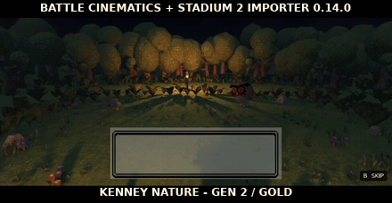
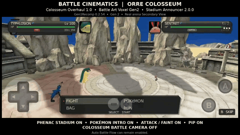
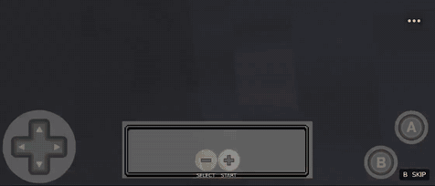
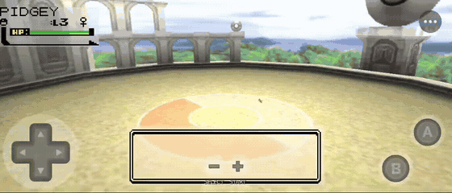

# 🎥 Battle Cinematics – Dynamic 3D Battle Camera

### A top-level cinematic battle director for Pokémon Recomp hosts

**Stadium 64 • DW3 Classic • Hero Portrait • Colosseum presentation • Phenac Stadium • 4-Way Sprite View • Pokémon Intro • Attack & Faint Cameras • Secondary View • Live Voxel Arenas**

<!-- PRIME SHOWCASE
Final target: media/Battle_Cinematics_Prime_Showcase.mp4
Optional short looping preview: media/Battle_Cinematics_Prime_Showcase.gif
The reel should show, in order: 4-Way sprites -> Crystal -> Gen5 animated -> genuine Stadium 3D -> Stadium/Intro/Attack/Faint -> Secondary View -> Live Voxel Arena.
-->

https://github.com/user-attachments/assets/c924c8c4-9fda-44be-b7e7-76e48cd88577

### Secondary showcases

  
  

*Stadium 2 Importer / Kenney Nature on Gen 2 · Colosseum Battle Environments / Orre Colosseum — provider presentation, BC camera direction.*

**Battle Cinematics (BC)** is the camera/director layer for battles. It brings the cinematic language of Pokémon Stadium into Recomp, then adapts that language around the presentation you choose: classic sprites, animated sprites, voxel worlds, genuine Stadium models and supported live battle hosts.

BC does **not** replace those renderers, models, animations or assets. It directs the camera around them, adapts to their presentation boundaries and can compose supported providers together without taking ownership of their content.

> **Stadium supplied the cinematography. BC supplied the camera system.**
>
> **BC directs. Providers present. Renderers render. Assets remain theirs.**

Stadium models are optional. Battle Cinematics is designed to make the presentation you already use look intentional from a moving cinematic camera.

**Quick links:** [Terrarium Advanced setup](#terrarium-advanced-174-setup) · [Compatibility chart](#compatibility) · [CBE 2.0 setup](#validated-cbe-20--colosseum-overhaul-configuration) · [Using BC](#using-battle-cinematics) · [Installation](#installation)

> [!TIP]
> **v1.5 — [Terrarium Advanced 1.7.4](https://github.com/diegolix29/Terrarium) integration on [Gen2Recomped](https://github.com/UNDERdecoded/Gen2Recomped).** Coherent Colosseum action, reaction, faint and send-in presentation across the tested singles, doubles and explicit OVERWORLD routes, alongside BC's independently selected idle presets and supported PiP. [Release notes](https://github.com/EnterPlayerOne/Battle-Cinematics-Stadium-Camera/releases/tag/v1.5.0).

## v1.5 — [Terrarium Advanced 1.7.4](https://github.com/diegolix29/Terrarium) integration

**Terrarium Advanced 1.7.4 on [Gen2Recomped](https://github.com/UNDERdecoded/Gen2Recomped) is the focus of this release.** BC now works with the integrated Colosseum presentation as a complete battle sequence: real trainer throws and Pokémon send-ins, source-led attacks and recipient reactions, native fainting and replacements, then a return to your chosen Stadium 64, DW3 Classic or Hero Portrait idle direction.

On staged singles, BC preserves Terrarium's already-resolved combat camera instead of independently rebuilding its timing. Doubles keeps the accepted four-subject presentation and source-derived action cameras. The provider continues to own the models, animations, effects, environment and battle progression.

**Plug and play:** leave **ATTACK CAMERA → AUTO / STADIUM**. Supported Colosseum routes select the Colosseum treatment automatically; ordinary supported routes retain Stadium. Explicit OFF remains OFF, and existing settings are not rewritten. Faint Camera and the idle preset remain separate choices.

**Tested scope:** the Gen 1 cartridge path is the showcase/control on Gen2Recomped. Water and Pyrite singles were exercised through varied attacks, reactions, faint/replacement, personal send-ins and different intros. Water doubles with Phenac and its PiP compatibility notice, and an explicit CBE OVERWORLD Route 1 wild battle with PiP, were also confirmed. **Gen 2/Prism remains limited; Gen 3 operability varies by cartridge and host/provider build.** These results are not an all-generation or all-arena certification.

**Secondary View:** supported singles retain PiP, including the tested explicit OVERWORLD route. Real doubles intentionally suppresses PiP for that battle and shows a compatibility notice without changing the saved setting.

This is **not a new [Gen1Recomp](https://github.com/bryanthaboi/gen1recomp)/Deluxe port of Advanced Terrarium**, nor a claim that the distinct [upstream Terrarium](https://github.com/diegolix29/Terrarium) package has the same integration. Existing original-host BC support remains in the tables below. Standalone CBE/Overhaul/AIO parity and a true retail Colosseum idle preset are separate future work; the selectable idle presets here remain Stadium 64, DW3 Classic, Hero Portrait and External.

**Updating an already-working setup:** replace **BC only** and restart the host. Keep Terrarium Advanced 1.7.4, imported assets/cache and saved preferences. New users need a working Terrarium Advanced Colosseum presentation first; BC does not bundle or import its assets. Battle Intro and PiP remain OFF by default. Diagnostics can be switched OFF after testing.

---

## v1.4.4 — Stadium2 Overworld Models 0.4.33 Secondary View

**[Stadium2 Overworld Models](https://github.com/randyadr/Gen2-3D-Sprites) 0.4.33 is now runtime-validated with BC's modern live-world Secondary View on the tested Gen 2 path.** The PiP redraws the provider's actual voxel battle environment through an independent BC camera while retaining the live Stadium Pokémon and provider weather. The provider's battle HUD/command UI stays in the main view instead of being baked into the private PiP.

**The full BC sequence remains active.** Stadium 64 / DW3 / Hero idle direction, Pokémon Intro, BC Attack Camera and Faint Camera continue to sit above the provider's presentation when those BC phases are enabled. The provider retains its own right-stick/manual-camera behavior outside BC-owned phases.

**PiP interaction is retained on both input paths.** Touch drag and mouse drag were both runtime-confirmed after the clean live-world PiP fix. Existing custom placement and the v1.4.1 visible-PiP first-refusal behavior remain unchanged.

The new path is **capability-based rather than tied to the 0.4.33 version label**. Older Stadium2 Overworld Models paths keep their established alternate-eye behavior; modern builds exposing the wrapped Weather FX renderer plus safe scene capture/restore can use BC's bounded single-eye private render. No provider files are modified.

Performance was reported good in the accepted live-world test, including weather inside the PiP, but this release does not claim quantitative frame-time profiling or every provider setting combination. The provider's integrated StadiumBattleFX presentation remains provider-owned and is not changed or certified by BC v1.4.4.

**Updating:** replace BC only and restart Recomp. Existing settings remain intact. Secondary View still defaults OFF for new users.

---

## v1.4.3 — Stadium 2 Importer 0.14.4 Compatibility

**[Stadium 2 Importer](https://github.com/Deftones565/gen1recomp-mod-stadium2-importer) 0.14.4 is supported directly on the tested Gen 1 and Gen 2 paths.** Kenney/custom environments and native Stadium/test arenas once again keep BC's main camera, live Pokémon and independent Secondary View together. Gen 1 PiP engagement, Gen 2 environment framing, native-arena camera alignment and matching PiP backgrounds are restored.

**Older proven setups remain supported.** BC selects the relevant Importer integration from the scene/camera capabilities it actually needs, rather than rejecting it solely because the release label changed. Direct **0.14.2** and **0.14.0**, and the separately documented older hosted routes, retain their own established scope. This is not blanket certification of future releases or every mixed-provider combination.

**Weather stays in the main view.** Importer continues to own its weather; BC's private PiP intentionally omits it, keeping the alternate view focused on the Pokémon without running another weather simulation.

**Phenac Stadium starts closer.** The shorter inward approach first used with [CBE](https://github.com/HighDrexler/Colosseum-Battle-Environments-1.0-BETA) is now the shared standard on already-supported Phenac paths. The full **13.2-second** sequence, later choreography and A/B handoff remain intact. Existing stage-admission and structural-safety limits still apply.

**Also retained:** [v1.4.2's real-arena CBE PiP](https://github.com/EnterPlayerOne/Battle-Cinematics-Stadium-Camera/releases/tag/v1.4.2) within its documented validation scope, plus [v1.4.1's desktop PiP dragging and Prism FRONT-facing correction](https://github.com/EnterPlayerOne/Battle-Cinematics-Stadium-Camera/releases/tag/v1.4.1).

**Updating:** replace BC only and restart Recomp. Keep your provider archives, imported assets/cache and saved settings. **Initial Delay remains 2 seconds. Battle Intro and Secondary View remain OFF for new users.**

**Earlier Kenney showcase:** [Kenney Nature — Gen 1](media/Battle_Cinematics_Stadium_2_Importer_014_Kenney_Nature_Gen1.gif)

*This is the earlier Gen 1 Kenney Nature showcase.*

## v1.4.0 — Gen2Recomped

Battle Cinematics now supports **[Gen2Recomped](https://github.com/UNDERdecoded/Gen2Recomped)** through UNDERdecoded's bundled **Dramatic Shapes** presentation layer while remaining the same single official BC package used on **[Gen1Recomp](https://github.com/bryanthaboi/gen1recomp)** / GoldRecomp.

Runtime-validated on **Gen2Recomped 0.7.49** with the **Dramatic Shapes 0.7.47 release payload** (the provider currently reports `0.7.40` in its manifest/in-game):

- **RBY / Gen 1**
- **Gold / Silver / Crystal / Gen 2**
- **Prism / Gen 2**
- **Emerald / Gen 3**

Validated BC features include **Pokémon Intro, Stadium/DW3/Hero idle direction, Attack Camera, Faint Camera, Dynamic 4-Way Sprite View, provider-native structural safety, and bounded Secondary View/PiP with resolution-invariant framing**.

> [!NOTE]
> **Prism and Emerald remain alpha host cartridges.** Structural safety is deliberately conservative in this first integration, especially in Prism caves; an authored Pokémon Intro may shorten, hold or fall back when the provider geometry says the route is obstructed. Results can vary by location. Prism's longer send-in delay is provider-owned.

> [!NOTE]
> **Phenac Stadium is intentionally hidden/disabled on the Gen2Recomped Dramatic Shapes host.** The validated encounter-level Phenac opening remains available on its established Gen1Recomp / GoldRecomp provider paths. Ordinary **Pokémon Intro remains available** on Gen2Recomped.

**Polished Crystal is not claimed yet** because the current host does not expose it as an importable runtime cartridge in the tested build.

---

## v1.3.2 — Battle Art / Legendary Compatibility

**[Battle Art Voxel Fork](https://github.com/absol89/DramaticShapeVoxelMod) 1.10.8 and the current Legendary visual stack are fully runtime-validated with official Battle Cinematics on Gen 1.** The normal BC camera suite remains active across Battle Art environments, including the Legendary cave presentation: passive presets, Pokémon Intro, Attack and Faint cameras, 4-Way Sprite View and Secondary View all retain their established roles.

**Caves do not require a fixed one-side camera lock.** Battle Art owns its cave geometry and clearance rules; BC keeps its authored cinematography and adapts through the supported presentation instead of replacing the battle with a permanent side view.

**No separate Battle Cinematics compatibility fork is required for this tested stack.** Install the current official Battle Cinematics release alongside Battle Art 1.10.8 and the Legendary visuals you want to use. Battle Art and Legendary assets remain provider-owned; BC remains the camera/director layer.

This is a **compatibility-certification release**. Runtime camera behaviour is unchanged from v1.3.1 apart from release/version identity. The broader 2D-card live-state Secondary View enhancement remains pinned for a later cross-host pass rather than being patched specifically for Battle Art.

> [!NOTE]
> This v1.3.2 certification is for **Battle Art Voxel Fork 1.10.8 / Legendary on Gen 1**. Battle Art Gen2 is a separately versioned provider and retains its own exact compatibility row and test status.

---

## v1.3.1 — Stadium 2 Importer 0.14.2 + Native Stadium Arenas

**[Stadium 2 Importer](https://github.com/Deftones565/gen1recomp-mod-stadium2-importer) 0.14.2 is now validated directly with Battle Cinematics on Gen 1 and Gen 2.** Kenney/custom environments, native test fields and gym test arenas keep the main camera, live battler and matching Secondary View background together. The Importer owns the environments, models, animation and renderer; BC supplies the enabled camera direction and independent PiP composition.

Native Stadium arenas now use their actual battler positions, field scale and presentation bounds. BC's main view sits lower and closer instead of spending the composition on empty floor, while PiP frames the Pokémon at native-arena scale rather than looking above it. **The accepted Kenney framing is preserved.** Gen 1 PiP engagement and the reported Gen 2 black-frame flicker are corrected in the validated 0.14.2 paths.

**Phenac Stadium now runs on the tested Gen 2 provider-selected environment and native arena stages.** BC checks the live stage selection rather than rejecting a self-contained arena based on the original overworld map. Classic-scene safety and the separate live-world indoor restrictions remain unchanged. Gen 1 Phenac retains its accepted behaviour.

The v1.3.0 Colosseum foundation is retained: [Colosseum Battle Environments](https://github.com/HighDrexler/Colosseum-Battle-Environments-1.0-BETA) 2.0 and [Colosseum Overhaul](https://github.com/HighDrexler/Colosseum-Inspired-UI-Overhaul-V.1.0.0) 1.0 on both generations, BC PRIORITY with the regular CBE camera ON or OFF, native Attack timing and runtime doubles arbitration. The arena-themed PiP cards shipped at that time are replaced by real resident-arena rendering on these exact packages in v1.4.2. See the current CBE setup below rather than historical Auto Battle Flow instructions.

> [!IMPORTANT]
> This is direct Importer **0.14.2** validation, not an automatic upgrade of every mixed-provider stack or a collision-free certification of every field. The separately reported Gen 2 Importer + Colosseum UI overlay conflict was reproduced on **0.14.0** with BC disabled; that UI stack is not recertified on 0.14.2 here.

**Battle Intro and Secondary View remain OFF for new users.** Existing saved BC choices remain intact.

### Stadium 2 Importer 0.14.2 — cave Phenac and attack

### Stadium 2 Importer 0.14.2 — Falkner test gym

**Earlier 0.14.0 Kenney showcases:** [Gen 2](media/Battle_Cinematics_Stadium_2_Importer_014_Kenney_Nature_Gen2.gif) · [Gen 1 / RBY](media/Battle_Cinematics_Stadium_2_Importer_014_Kenney_Nature_Gen1.gif)

---

## What Battle Cinematics changes during a battle

BC is modular. Use the complete presentation or only the camera phases you want.

| Battle moment | Battle Cinematics |
|---|---|
| **Idle / command menu** | Stadium 64, DW3 Classic, Hero Portrait or External host camera |
| **Flat sprites** | Camera-aware **4-Way Sprite View** where supported |
| **Battle opening** | Optional PHENAC STADIUM, independently assigned to Wild, Trainer, Gym Leader, Elite Four, Champion and Rival battles |
| **Pokémon send-in** | BC Hero FULL / COMPACT on established routes; provider trainer throw → source-derived resident reveal on supported Terrarium Colosseum routes |
| **Moves** | AUTO / STADIUM selects the supported host treatment; Terrarium Colosseum uses its source-led combat lifecycle while ordinary hosts retain Stadium |
| **Faint** | Dedicated defeated-Pokémon presentation; supported Terrarium staged singles follows the provider's native faint camera and handoff |
| **Secondary view** | Optional independent PiP camera with **LIVE VIEW**, **LIVING PORTRAIT** or **DYNAMIC (DW3)** presentation |
| **PiP quality** | Independent internal render resolution from **160x90 through 1280x720** |
| **PiP appearance** | Independent ROUNDED / COLOSSEUM frame and WHITE / DARK / COLOSSEUM GREY border |
| **Stadium 2 Importer arena** | Optional **LIVE VOXEL ARENA** override where a compatible live-world provider is actually available |
| **Manual camera** | BC-owned on Gen 1 and on CBE in both generations; other Gen 2 providers retain their own control |

The core rule underneath all of it is:

> **Every BC option produces a good, readable battle everywhere, with BC free to gracefully degrade its physical camera language when the environment cannot support it.**

---

# Compatibility

Battle Cinematics is a director, not a battle renderer. A supported presentation host still owns the world, sprites, models and animation it provides.

**v1.5 scope:** the new [Terrarium Advanced 1.7.4](https://github.com/diegolix29/Terrarium) integration below is separate from the retained original-host and bundled-Dramatic matrices. A check mark in one provider/host row does not certify another. The latest Terrarium runtime confirmation is the Gen 1 showcase/control path on the user's tested Gen2Recomped setup; its host APK version was not pinned in this release record. Terrarium Advanced itself is pinned exactly to **1.7.4**.

**Retained v1.4.4 compatibility:** **[Stadium2 Overworld Models](https://github.com/randyadr/Gen2-3D-Sprites) 0.4.33** now has runtime-accepted modern live-world Secondary View on the tested Gen 2 path: live voxel environment, live Stadium Pokémon, provider weather, provider UI excluded from the private PiP, and both touch/mouse PiP dragging retained. Direct [Stadium 2 Importer](https://github.com/Deftones565/gen1recomp-mod-stadium2-importer) **0.14.4 / 0.14.2 / 0.14.0**, **[Gen2Recomped](https://github.com/UNDERdecoded/Gen2Recomped) 0.7.49 + [Dramatic Shapes](https://github.com/UNDERdecoded/Gen2Recomped/releases/tag/v0.7.47) 0.7.47 release payload**, **[Battle Art Voxel Fork](https://github.com/absol89/DramaticShapeVoxelMod) 1.10.8 + the current Legendary visual stack**, [CBE](https://github.com/HighDrexler/Colosseum-Battle-Environments-1.0-BETA) 2.0 and [Colosseum Overhaul](https://github.com/HighDrexler/Colosseum-Inspired-UI-Overhaul-V.1.0.0) 1.0 retain their accepted scope and caveats below. Other rows keep their own exact version pins and limits.

**Key:** ✅ = validated within the row’s stated host, generation and setup; ⚠️ = the recorded partial / re-audit status, not a new compatibility pass. **3D yield** means 4-Way Sprite View correctly leaves genuine 3D models alone; it is not a camera failure.

**Ma
